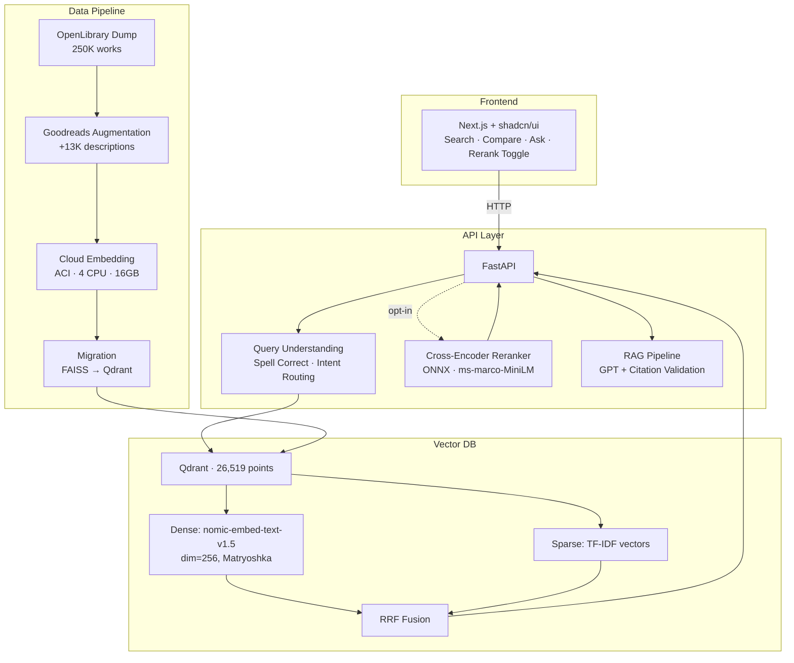
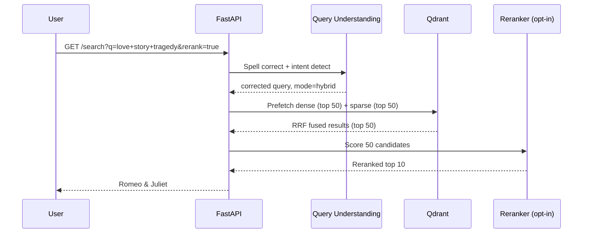
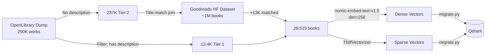
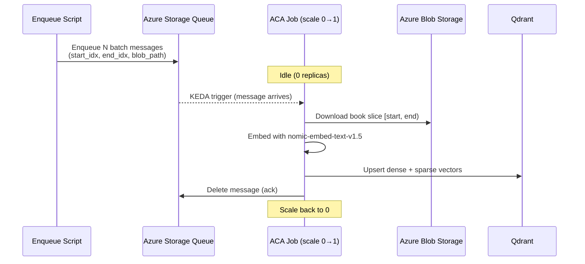

# 📚 BookSearch — Hybrid Semantic Search Engine

A production-grade hybrid search engine over 26,500+ books from the OpenLibrary catalog. Combines TF-IDF sparse retrieval with dense vector search (nomic-embed-text-v1.5) using Reciprocal Rank Fusion, plus an optional cross-encoder reranker — all self-hosted on Qdrant.

Built as a portfolio piece demonstrating **backend + ML infrastructure engineering**.

---

## Architecture



### Query Flow



### Data Pipeline



### Embedding Worker (Event-Driven)



---

## Tech Stack

| Layer | Technology |
|-------|-----------|
| **Frontend** | Next.js 16, TypeScript, Tailwind CSS, shadcn/ui |
| **API** | FastAPI, Python 3.11, Pydantic |
| **Vector DB** | Qdrant (self-hosted, Docker) |
| **Embeddings** | nomic-embed-text-v1.5 (Matryoshka, dim=256) |
| **Sparse Retrieval** | TF-IDF (scikit-learn) |
| **Reranker** | cross-encoder/ms-marco-MiniLM-L-6-v2 (ONNX Runtime) |
| **RAG** | Azure OpenAI (GPT) with citation validation |
| **Query Understanding** | SymSpell (spell correction) + intent routing |
| **Cloud Infra** | Azure Container Instances, ACR, Blob Storage |
| **IaC** | Bicep (ACA templates ready) |

---

## Features

- **Hybrid Search (RRF)** — Reciprocal Rank Fusion of TF-IDF + dense vectors. Best of both worlds: keyword precision + semantic understanding.
- **Cross-Encoder Reranker** — Optional two-stage retrieval. ONNX-optimized for CPU (~600ms for 50 candidates). Promotes semantically relevant results (e.g., "love story tragedy" → Romeo & Juliet #1).
- **Query Understanding** — Spell correction (SymSpell), intent detection, query-adaptive mode routing.
- **RAG with Guardrails** — Natural language Q&A grounded in retrieved books. Citation validation prevents hallucinated titles.
- **Compare View** — Side-by-side 3-column comparison of keyword vs. hybrid vs. vector results.
- **Evaluation Framework** — MRR@10, NDCG@10, Recall@10 across multiple query categories with synthetic + LLM-judged relevance.

---

## Eval Results

### Hybrid vs. Vector vs. Keyword (26.5K corpus)

| Mode | Hit@10 | MRR@10 | Avg Latency |
|------|--------|--------|-------------|
| Keyword (TF-IDF) | 33.3% | 0.173 | 44ms |
| Vector (nomic-256d) | 24.2% | 0.150 | 315ms |
| **Hybrid (RRF)** | **33.3%** | **0.208** | 278ms |

### Reranker Impact (natural-language queries)

| Query | Without Reranker | With Reranker |
|-------|-----------------|---------------|
| "love story tragedy" | Love Stories, In Short | **Romeo & Juliet**, Carmen |
| "scottish highland romance" | Highland hero | **Seducing the Highlander** |
| "cooking recipes food" | EveryGirl's guide | **One pot**, Chinese Cookery |
| "computer programming" | BASIC is child's play | **Python for Software Design** |
| "ancient Rome historical fiction" | Enemy of Rome, Top 10 Rome | **Child of the Sun**, SPQR |

Reranker improves result quality on 9/10 test queries at ~600ms additional latency.

---

## Getting Started

### Prerequisites

- Python 3.11+
- Docker (for Qdrant)
- Node.js 18+ / pnpm (for frontend)

### Quick Start

```bash
# 1. Clone and install
git clone https://github.com/TruaShamu/ai-search.git
cd ai-search
pip install -r requirements.txt

# 2. Start Qdrant
docker run -d --name qdrant -p 6333:6333 -v qdrant_storage:/qdrant/storage qdrant/qdrant:latest

# 3. Run migration (loads data into Qdrant)
python -m src.qdrant.migrate --qdrant-url http://localhost:6333 --collection books --recreate

# 4. Start API
export QDRANT_URL=http://localhost:6333
uvicorn src.api.main:app --host 0.0.0.0 --port 8000

# 5. Start frontend
cd web && pnpm install && pnpm dev
```

Open http://localhost:3000

### Environment Variables

| Variable | Description | Default |
|----------|-------------|---------|
| `QDRANT_URL` | Qdrant server URL | `http://localhost:6333` |
| `QDRANT_COLLECTION` | Collection name | `books` |
| `AZURE_OPENAI_ENDPOINT` | For RAG /ask endpoint | — |
| `AZURE_OPENAI_API_KEY` | For RAG /ask endpoint | — |

---

## Project Structure

```
src/
├── api/            FastAPI application (search, ask, health, stats)
├── qdrant/         Qdrant client (hybrid search) + migration script
├── search/         Embedding pipeline (nomic-embed-text-v1.5)
├── reranker/       Cross-encoder reranker (ONNX + PyTorch fallback)
├── rag/            RAG generation with hallucination guardrails
├── query/          Query understanding (spell, intent, expansion)
├── eval/           Evaluation framework (MRR, NDCG, Recall)
├── etl/            Data pipelines (OpenLibrary + Goodreads augmentation)
└── azure_search/   Azure AI Search client (legacy, superseded by Qdrant)

web/                Next.js frontend (search UI, compare view, ask tab)
infra/              Bicep templates (ACA deployment)
scripts/            Cloud embedding automation
data/
├── raw/            OpenLibrary dumps
├── processed/      Augmented catalog (books_augmented.jsonl)
├── index/          FAISS index, metadata, TF-IDF vectorizer
├── eval/           Evaluation datasets + results
└── models/         ONNX reranker model
```

---

## Design Decisions

| Decision | Rationale |
|----------|-----------|
| **Qdrant over Azure AI Search** | 15x faster (24ms vs 370ms), no tier limits, built-in RRF, self-hosted |
| **TF-IDF over BM25** | Sufficient at 26K scale; hybrid compensates. BM25's length norm matters more at >100K docs |
| **Matryoshka dim=256** | nomic-embed-text-v1.5 trained checkpoints: 768/512/256/128/64. 256 balances quality vs. index size |
| **Reranker opt-in** | Adds ~600ms; quality improvement is clear but latency tradeoff should be user's choice |
| **Goodreads augmentation** | OpenLibrary lacks descriptions for 95% of books. Title-match join doubled the corpus |
| **ONNX reranker** | 3.7x faster than PyTorch on CPU (23ms vs 86ms for 4 candidates) |
| **Cloud embedding (ACI)** | Local GPU unavailable; 4-CPU ACI with 16GB RAM handles 26K docs in ~3h |

---

## API Endpoints

| Endpoint | Method | Description |
|----------|--------|-------------|
| `/search` | GET | Hybrid search with mode, rerank, filters |
| `/search/compare` | GET | Side-by-side results across all modes |
| `/ask` | POST | RAG question answering with citations |
| `/health` | GET | Service health check |
| `/stats` | GET | Index statistics |

### Example

```bash
# Hybrid search
curl "http://localhost:8000/search?q=scottish+romance&mode=hybrid&top_k=5"

# With reranking
curl "http://localhost:8000/search?q=love+story+tragedy&rerank=true"

# RAG question
curl -X POST http://localhost:8000/ask \
  -H "Content-Type: application/json" \
  -d '{"question": "What are some good books about Scottish history?"}'
```

---

## License

MIT
