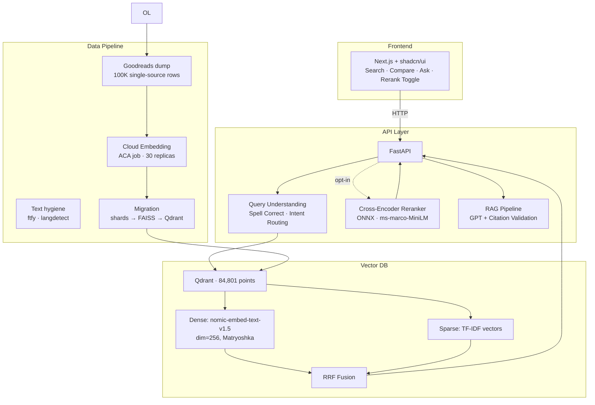
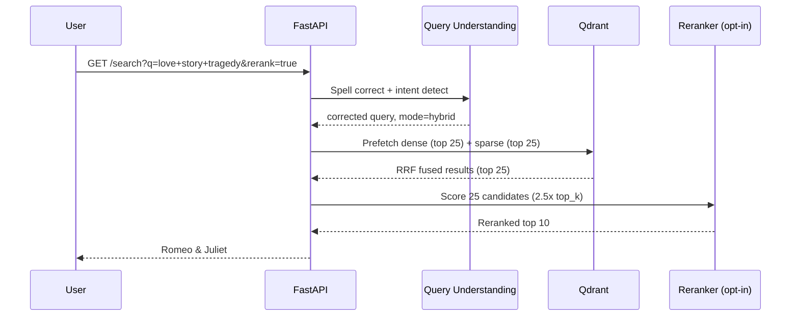
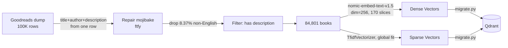
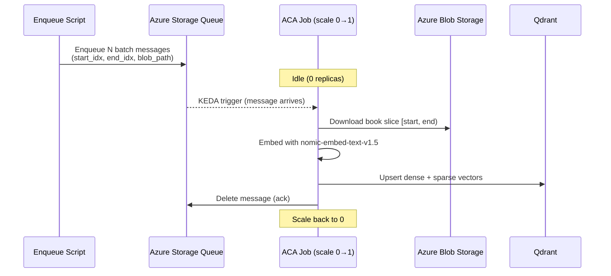

# 📚 BookSearch — Hybrid Semantic Search Engine

A hybrid search engine over 84,801 books. Combines TF-IDF sparse retrieval with dense vector search (nomic-embed-text-v1.5) using Reciprocal Rank Fusion, plus an optional cross-encoder reranker — all self-hosted on Qdrant and deployed to Azure Container Apps with full CI/CD.

Built as a portfolio piece demonstrating **backend + ML infrastructure engineering**.

---

## Architecture



### Query Flow



### Data Pipeline



Every field on a record comes from the same source row, so a description can
never be attached to another author's book. That is the whole reason for the
migration — see [Corpus Provenance](#corpus-provenance-and-a-data-bug-the-eval-could-not-see).

### Embedding Worker (Event-Driven)



---

## Tech Stack

| Layer | Technology |
|-------|-----------|
| **Frontend** | Next.js 16, TypeScript, Tailwind CSS, shadcn/ui |
| **API** | FastAPI, Python 3.11, Pydantic |
| **Vector DB** | Qdrant (self-hosted, Docker) |
| **Embeddings** | nomic-embed-text-v1.5 (Matryoshka, dim=256) |
| **Sparse Retrieval** | TF-IDF (scikit-learn) |
| **Reranker** | cross-encoder/ms-marco-MiniLM-L-6-v2 (ONNX Runtime) |
| **RAG** | Azure OpenAI (GPT) with citation validation |
| **Query Understanding** | SymSpell (spell correction) + intent routing |
| **Cloud Infra** | Azure Container Instances, ACR, Blob Storage |
| **IaC** | Bicep (ACA templates ready) |

---

## Features

- **Hybrid Search (RRF)** — Reciprocal Rank Fusion of TF-IDF + dense vectors. Best of both worlds: keyword precision + semantic understanding.
- **Cross-Encoder Reranker** — Optional two-stage retrieval. ONNX-optimized for CPU with length-bucketed batching. On the current v2 index it lifts known-item Acc@1 from 86% to 98% with **zero regressions across 80 paired queries**; an earlier v1 graded eval put the gain at +0.097 NDCG. Available as a toggle because it costs ~2.1s — see eval findings below for where it helps most.
- **Query Understanding** — Spell correction (SymSpell), intent detection, query-adaptive mode routing.
- **RAG with Guardrails** — Natural language Q&A grounded in retrieved books. Citation validation prevents hallucinated titles.
- **Compare View** — Side-by-side 3-column comparison of keyword vs. hybrid vs. vector results.
- **Evaluation Framework** — Two independent harnesses: a graded relevance eval with paired bootstrap confidence intervals (MRR@10, NDCG@10, Recall@10) via `scripts/eval_redesign.py`, and a corpus-sampled known-item accuracy gate via `python -m src.eval.known_item_eval`. The LLM judge is itself validated against **89 hand-labeled pairs** (`python -m src.eval.label`), which is how a corpus data bug that the automated eval was structurally blind to got caught. Limitations are documented rather than glossed over.

---

## Eval Results

Evaluated on **100 corpus-grounded queries** against the live production deployment, with **5,000 query–document pairs** LLM-judged on a graded 0/1/2 scale and **zero unjudged pairs**. Confidence intervals are 1,000-replicate percentile bootstraps; mode comparisons use a **paired** bootstrap on per-query deltas. Reproducible via `python scripts/eval_redesign.py --step all`.

> **Scope note: the graded tables in this section (NDCG / MRR / Recall) are v1-corpus results.** They are honest measurements of the system as deployed when taken, but the corpus they ran against has a documented description-provenance defect — see [Corpus Provenance](#corpus-provenance-and-a-data-bug-the-eval-could-not-see) before quoting any absolute number. The relative comparisons between modes are unaffected. The [Known-Item Accuracy](#known-item-accuracy-50-titles-sampled-from-the-corpus) results further down **are** measured on the current v2 84,801-book index and are labeled accordingly.

Six queries (all `author`) were dropped for having no relevant document in the pool, leaving **n=94** evaluated across every mode.

### Retrieval Quality (k=10, v1 26.5K corpus)

| Mode | MRR@10 | NDCG@10 | Recall@10 | Median Latency |
|------|--------|---------|-----------|----------------|
| Keyword (TF-IDF) | 0.851 [0.784, 0.911] | 0.593 [0.534, 0.649] | 0.440 [0.370, 0.508] | 131ms |
| Vector (nomic-256d) | 0.896 [0.841, 0.946] | 0.698 [0.648, 0.743] | 0.514 [0.451, 0.569] | 213ms |
| **Hybrid (RRF)** | 0.910 [0.858, 0.954] | 0.703 [0.660, 0.749] | 0.523 [0.459, 0.590] | **209ms** |
| **Hybrid + Rerank** | **0.985 [0.962, 1.000]** | **0.801 [0.769, 0.835]** | **0.583 [0.525, 0.641]** | 3,268ms |

Recall@10 is bounded above by **0.794** on average, because a pool can hold more than ten relevant documents while only ten can be returned.

### Threshold Sensitivity — What 0.985 Actually Means

The table above counts a document as relevant at **grade ≥ 1** ("partially relevant" or better). On this pool that is a lenient bar: **11.95 of 50** pooled documents clear it, so simply shuffling the pool scores **0.376**. Quoting 0.985 without that denominator would be the most misleading number in this README.

Recomputing every mode under a **strict** threshold that counts only grade-2 ("fully relevant") documents — same 94 queries, same ranked lists, same judgments:

| Mode | MRR@10 (grade ≥ 1) | MRR@10 (grade = 2) | Recall@10 (grade = 2) |
|------|--------------------|--------------------|-----------------------|
| *Random shuffle* | *0.376* | *0.111* | — |
| Keyword (TF-IDF) | 0.851 | 0.659 [0.568, 0.746] | 0.593 |
| Vector (nomic-256d) | 0.896 | 0.782 [0.704, 0.858] | 0.739 |
| Hybrid (RRF) | 0.911 | 0.776 [0.703, 0.849] | 0.743 |
| **Hybrid + Rerank** | **0.985** | **0.881 [0.815, 0.940]** | **0.818** |

Two things survive the harder bar:

- **The result holds.** 0.881 against a 0.111 random baseline is a **7.9×** lift, which is a far more meaningful claim than 0.985 against 0.376.
- **Reranking looks better under scrutiny, not worse.** Its margin over hybrid *grows* from **+0.074** at the lenient threshold to **+0.105** at the strict one. The reranker is not just pulling *something* relevant to rank 1; it disproportionately pulls the *best* document to rank 1 — precisely what a lenient MRR is blind to.

Only 87 of the 94 queries have any grade-2 document pooled; the other 7 score zero for every mode, which depresses all four columns equally and leaves the comparison intact. The random baseline is Monte Carlo over actual per-query pool sizes and relevant counts, and agrees with the closed-form expectation to within 0.002. Reproduce with `python scripts/threshold_sensitivity.py --offline`.

The lenient column here was re-fetched from the live API independently of the headline table and reproduces it to within 0.001 on every mode, which doubles as a reproducibility check on the original run. The raw ranked lists are committed to `data/eval/v2/rankings_v1.json` so these numbers remain verifiable after the corpus changes.

### Paired Comparisons

Bootstrapping per-query *differences* rather than comparing independent means removes query-difficulty variance, which is what makes these gaps resolvable at n=94.

| Comparison | NDCG@10 delta | 95% CI | MRR@10 delta | 95% CI |
|------------|---------------|--------|--------------|--------|
| Hybrid − Keyword | **+0.111** | [+0.079, +0.146] | +0.059 | [+0.014, +0.112] |
| Hybrid+Rerank − Hybrid | **+0.097** | [+0.060, +0.135] | +0.075 | [+0.026, +0.125] |
| Hybrid+Rerank − Keyword | **+0.208** | [+0.159, +0.260] | +0.134 | [+0.072, +0.197] |

All six intervals exclude zero. Eleven unadjusted intervals were computed in total, so roughly 0.6 would be expected to exclude zero by chance; the observed effects are far larger than that.

### Where Reranking Helps

| Category | n | Hybrid NDCG | +Rerank | Delta | 95% CI |
|----------|---|-------------|---------|-------|--------|
| author | 12 | 0.750 | 0.886 | +0.136 | [+0.030, +0.277] |
| combined | 10 | 0.832 | 0.831 | −0.000 | [−0.146, +0.139] |
| exploratory | 21 | 0.693 | 0.806 | +0.113 | [+0.042, +0.193] |
| genre_topic | 32 | 0.647 | 0.739 | +0.092 | [+0.039, +0.143] |
| title_lookup | 19 | 0.713 | 0.829 | +0.116 | [+0.051, +0.200] |

Reranking helps everywhere except **combined** filter-style queries, where hybrid already scores 0.83 and the interval spans zero. Only `genre_topic` clears n=30; the rest are underpowered individually and should be read as directional.

### Ceiling Analysis

A perfect reranker over the same 25-candidate pool would score **0.917** NDCG against hybrid's **0.703** — headroom of **+0.214**. The cross-encoder captures **+0.097**, or about **45%** of what is theoretically available at that depth. The remaining gap is a retrieval problem, not a ranking one: it can only be closed by getting better candidates into the pool.

### Known-Item Accuracy (50 titles sampled from the corpus)

A second, independent eval: sample a book from the index, search its exact title, check whether that book comes back first. No LLM judge, no pooling, no subjective grading — the answer is either right or wrong, and anyone can verify it by hand in a few seconds.

**Measured on the v2 84,801-book index** (`python -m src.eval.known_item_eval`):

| Mode | Acc@1 | Acc@5 | MRR | v1 Acc@1 (26.5K) |
|------|-------|-------|-----|------------------|
| **Vector (nomic-256d)** | **94%** | 96% | 0.950 | 100% |
| Hybrid (RRF) | 86% | **98%** | 0.917 | 94% |
| Keyword (TF-IDF) | 66% | 80% | 0.732 | 74% |

Every mode scores lower than it did on v1, and that is the expected cost of an index **3.2× larger**: the same query now competes against three times as many plausible titles. The v1 column is shown for scale, not as a regression — the two numbers describe different systems, which is why the v1 baseline was archived rather than reused as a CI gate.

**The interesting result is that hybrid no longer wins at rank 1.** On v1, hybrid (94%) sat between vector (100%) and keyword (74%). On v2 the keyword arm degrades from 74% to 66%, and RRF fusion propagates that: hybrid's Acc@1 (86%) now falls *below* pure vector (94%). Hybrid still has the best top-5 recovery (**98%**, above vector's 96%), so fusion is still buying recall — it is buying it at a cost in top-1 precision that did not exist at 26K. This is the concrete evidence behind the "TF-IDF over BM25" entry in the decisions table being the closest call in this project: TF-IDF's lack of length normalization is exactly the weakness that shows up as a corpus grows.

Keyword's failures remain concentrated rather than random: **74%** accuracy on distinctive titles (31/42) vs **25%** on titles made of common words (2/8). This is inherent to lexical scoring, not an indexing defect.

The same harness also runs 30 **hard variants** — typos, partial titles, and title-plus-author forms — as a robustness check:

| Mode | Acc@1 | Acc@5 |
|------|-------|-------|
| Hybrid (RRF) | **73%** | **87%** |
| Vector | **73%** | 80% |
| Keyword (TF-IDF) | 67% | 87% |

Degradation is graceful rather than catastrophic, and hybrid retains the best combined top-5 recovery. This eval doubles as a CI regression gate: every deploy re-runs all four modes against the live container and fails the build if **hybrid or hybrid+rerank** accuracy drops more than 5 points below the recorded baseline.

#### Reranking on v2: a paired test

The graded NDCG tables above are v1 measurements, so they cannot speak for the reranker as currently deployed. This harness can: `--modes hybrid,hybrid+rerank` runs both arms over identical queries against the identical index in a single pass, so the reranker is the only variable.

| Fixture | Mode | Acc@1 | Acc@5 | MRR |
|---------|------|-------|-------|-----|
| Standard (n=50) | Hybrid | 86.0% | 98.0% | 0.913 |
| Standard (n=50) | **Hybrid + rerank** | **98.0%** | **100.0%** | **0.987** |
| Hard variants (n=30) | Hybrid | 73.3% | 86.7% | 0.800 |
| Hard variants (n=30) | **Hybrid + rerank** | **90.0%** | **96.7%** | **0.925** |

The aggregate (+12.0pp and +16.7pp Acc@1) understates the result, because an average can hide a reranker that wins often and loses badly. The paired breakdown shows it does not:

| Fixture | Fixed by rerank | Broken by rerank | McNemar exact *p* |
|---------|-----------------|------------------|-------------------|
| Standard | 6 | **0** | 0.031 |
| Hard variants | 5 | **0** | 0.0625 |

**Zero regressions across 80 paired queries.** The hard-variant *p* of 0.0625 looks like a failure to reach significance, but it is the *floor* for five discordant pairs pointing the same way (2 × 2⁻⁵) — it is as significant as that sample size permits, not weak evidence.

> Hybrid's un-reranked Acc@1 moves between **86% and 88%** across runs (one item is 2pp at n=50); the recorded CI baseline happens to sit at 88%. The paired comparison is unaffected by that drift, because both arms are measured in the same run against the same index — which is the reason it is run paired rather than compared against a stored number.

Two details worth more than the headline number. Most gains are **rank 2 → 1**, which is the fine-grained top-of-list discrimination a cross-encoder is supposed to provide rather than a wholesale reshuffle. And two documents were promoted from *outside* the top 10 — evidence the 2.5× candidate pool does real work, since a reranker confined to the original top 10 could not have found them.

The cost is the reason this stays opt-in: a reranked query runs **~2.1 s end-to-end vs ~200 ms** for plain hybrid.

That cost used to be roughly twice as high. The cross-encoder scored all 25 candidates in one batch with `padding=True`, so a single long description set the tensor width for every short one — **45.2% of processed tokens were padding**. Sorting candidates by length and scoring them in sub-batches of 4, each padded only to its own longest member, cuts padding to 17.7% (33.4% fewer tokens overall). Because padding is masked by `attention_mask`, this changes no score: measured max absolute difference vs. the flat batch is **exactly 0.0** across 12 trials of 25 real candidates, with zero ranking changes.

| | Flat batch | Length-bucketed | Change |
|---|---|---|---|
| Rerank stage (production) | 3642 ms | **1812 ms** | **2.01× faster** |
| End-to-end (production) | 4096 ms | **2089 ms** | 1.96× faster |
| Padding share of tokens | 45.2% | **17.7%** | 33.4% fewer tokens |

Batch size 4 was picked from a measured sweep rather than by feel. At 25 candidates the curve is flat between 2 and 6 (676–781 ms locally); 4 captures nearly all of the win with half the ONNX Runtime invocations of 2, which is the cost most likely to grow on a smaller container. Setting it to 25 reproduces the flat-batch time exactly, which is the sanity check that one bucket spanning everything *is* the old behaviour.

The riskiest part is the scatter-back: returning scores in sorted order would mis-attribute every score while still producing a plausible-looking ranking. `tests/test_reranker_batching.py` covers it with fakes rather than the 86 MB ONNX model, so it runs on a clean clone — and reverting the scatter to sequential assignment fails 8 of its 11 tests.

**Serving latency at 84.8K points** (warm, hybrid, k=10, n=32 against the live deployment): median **182 ms**, p95 **434 ms**. A cold first request costs ~4 s while the embedding model loads, which is why readiness gating exists.

### Key Findings

- **Hybrid beats keyword, and this time the data supports it.** An earlier version of this eval put the gap at 0.003 MRR against a standard error near 0.07 — indistinguishable from noise. That result was an artifact: the query set had been generated by an LLM with no view of the corpus, producing canonical titles (*1984*, *The Great Gatsby*) against an index of mostly obscure OpenLibrary works, and carrying no gold documents. On corpus-grounded queries the margin is **+0.111 NDCG [+0.079, +0.146]**.
- **Cross-encoder reranking helps, and the earlier finding that it hurt was caused by a bug in my own code.** `onnx_reranker.py` truncated every passage at `[:300]` characters, discarding **60.2% of all description text across 62% of documents** (median description length is 477 characters, 90th percentile 1,289). The cross-encoder was scoring fragments while RRF fused the full index. With truncation fixed, reranking gains **+0.097 NDCG [+0.060, +0.135]** over hybrid and lifts MRR to **0.985** — and the gain *grows* to +0.105 MRR under the strict grade-2 threshold, so it is promoting the best document rather than merely a relevant one. This finding **replicated on the v2 corpus under a different method**: a paired known-item test moved Acc@1 from 86% to 98% with 11 queries fixed and 0 broken. Two independent evals, two corpora, same direction.
- **Fixing the quality bug exposed a capacity bug that had been hiding behind it.** Full-length passages take the cross-encoder from ~93 tokens to ~335. On the original 1 vCPU container that pushed `rerank=true` past the ingress timeout: 3 of 6 requests failed and one took 98 seconds. The API now runs on 2 vCPU with a readiness probe, where reranking is 10/10 successful — at a 3.3s median then, and ~1.8s now that length-bucketed batching stopped the model padding every candidate to the longest one. Truncation had been masking the fact that the container could not afford the work.
- **Dense retrieval is stronger than lexical here, and both evals agree.** Vector beats keyword by +0.105 NDCG in the graded eval and by 28 points of known-item Acc@1 on the v2 index (94% vs 66%). The previous claim that "vector alone underperforms keyword" came from a pool built from keyword-friendly candidates that stored no negatives, so dense retrieval was penalized for surfacing books the pool had never judged.

> Reranking stays an **opt-in toggle** rather than a default. The quality gain is real and reproduced on v2, but ~2.1s is still too slow to impose on every search when plain hybrid answers in ~200ms. It is worth the wait on exploratory queries — "love story tragedy" returns Romeo & Juliet first with reranking on.

### Known Limitations of This Eval

Stated plainly, because they bound what the tables above can support:

- **The judge has been validated against human labels, and the agreement is only fair.** I hand-labeled **89 pairs** across two rounds with the machine's grade hidden (`python -m src.eval.label`). On the **representative random sample (n=40)** — the round whose kappa is directly interpretable — Cohen's kappa is **0.314 [0.056, 0.562]** at 65% raw agreement. A separate stratified round (n=49) scores 0.542, but stratified sampling over-represents rare grades and inflates kappa; post-stratifying it back to true prevalence gives **0.308**, independently reproducing the random round's 0.314. That is **"fair" agreement, not "substantial."** Every graded number above rests on labels a human agrees with about two-thirds of the time. Reproduce with `python -m src.eval.judge --agreement data/eval/v2/judgments.json data/eval/v2/human_random.json`.
- **The judge errs strict, not lenient.** Across all 89 human labels, the human graded *higher* than the judge 24 times and *lower* 5 times. Whatever else the labels get wrong, they are more likely to understate this system than to flatter it.
- **Query generation and judging share a model family,** so blind spots may be correlated rather than independent. The specific concern was that a cross-encoder and an LLM judge both reward surface semantic similarity, which would inflate the measured reranking gain. The human labels are evidence against that: of the **20** pairs the judge graded 2, the human called **zero** irrelevant (18 exact agreements, 2 downgraded to "partial"). The judge's top grade does not look like a false-positive channel — though n=20 is small enough that this argues against the worry rather than closing it.
- **Per-category results are underpowered.** Four of five categories have n < 30 and are flagged accordingly. Only `genre_topic` (n=32) is individually well-powered.
- **Recall is capped by construction** at a mean ceiling of 0.794, so recall figures are not comparable to systems evaluated with complete relevance judgments.
- **Documents outside the judged pool count as non-relevant.** This is standard for pooled evaluation, and was verified not to penalize reranking: across sampled queries, **0 of 120** reranked top-10 documents fell outside the pool.
- **Six author queries were dropped** for having no relevant document, which slightly biases that category toward the queries the system could already answer.
- **Labels come from a zero-shot `gpt-5.4-nano` judge**, not the richer calibrated judge in `src/eval/judge.py` — `scripts/eval_redesign.py` uses its own simpler prompt.
- **The graded eval has not been re-run on the v2 corpus.** The NDCG/MRR/Recall tables above are v1 measurements. Re-running them means regenerating corpus-grounded queries and re-judging 5,000 pairs; until that happens, the v2 numbers in this README are the known-item results (including the paired reranker test), and latency — all labeled as such. The v1 raw ranked lists are committed to `data/eval/v2/rankings_v1.json` so the old numbers stay verifiable. Note that the eval fixtures are **corpus-coupled**: v1 gold document ids have 0% overlap with the v2 id space, so the old judgments are structurally unrunnable rather than merely stale.

### Corpus Provenance, and a Data Bug the Eval Could Not See

Everything above was measured against **v1 of the corpus**, which has a data-quality defect worth stating in full. It bounds how the tables should be read, and finding it was the most useful thing the human labeling round did.

**Where it came from.** All 26,519 books are OpenLibrary records, but only **5.4%** of OpenLibrary works (13,431 of 250,811 scanned) carry a description — and description is the highest-signal field for semantic retrieval. To raise coverage, an augmentation step joined an external Goodreads description dataset onto the corpus. That dataset (`booksouls/goodreads-book-descriptions`, 1.02M rows) ships **only `title` and `description`** — there is no author column — so normalized title was the only join key available. On a title collision, `choose_better_description` kept the *longest* candidate. That fails **open**: an ambiguous match yields a confident-looking wrong answer instead of no answer.

**What it costs.** Measured directly from the index:

| Description source | Records | Duplicate-description rate |
|---|---|---|
| OpenLibrary (native, joined on work ID) | 13,431 | **0.5%** |
| Goodreads (augmented, joined on title) | 13,088 | **26.5%** |

**3,383 records — 12.8% of the index — provably carry a description belonging to a different author's book.** *The Ugly Duckling* by Hans Christian Andersen is described as a thriller about an assassination attempt on a financier's wife. **12.8% is a floor, not an estimate:** it counts only collisions where two books share one description, which is the sole signature detectable from the data. A further 9,743 Goodreads-sourced records matched a unique title and cannot be verified either way.

**Why the eval scored it as fine.** The eval is a closed loop. A wrong description is embedded, retrieved for the query it lexically matches, and then read by the LLM judge — which grades it relevant, because *against the text it was shown*, it is. Mean grades by provenance are statistically indistinguishable (**0.268** OpenLibrary vs **0.263** Goodreads). More LLM judging would never have surfaced this; only a human comparing a description against its own title could, which is exactly how it was found. **583 of 5,000 judged pairs (11.7%) used a provably corrupted description.**

**Why the fix is a migration and not a patch.** Failing closed on collisions is the obvious repair, and it is insufficient: Goodreads holds only one *Ugly Duckling*, so Andersen's title matched 1:1 with no collision to detect. This is a **cross-corpus** mismatch, and with no author or ISBN in the source it is unfixable in principle. The corpus was therefore migrated to a single-source dataset carrying title, author, and description in the same record, which makes this class of error **impossible to represent** rather than merely less likely.

> **Read the tables above as v1 results.** They are honest measurements of the system as deployed when they were taken, and the retrieval comparisons between modes are unaffected — every mode searched the identical index, so a shared data defect cannot favor one over another. What the defect does undermine is the absolute claim that a top-ranked result is the *right book*. That claim is what the migration below restores.

### v2: What the Migration Changed

The index now holds **84,801 books** whose title, author, and description all come from the same source row. Two further defects surfaced while building it, both found by measuring rather than assuming:

| Property | v1 | v2 |
|---|---|---|
| Records | 26,519 | **84,801** |
| Cross-author description corruption | ≥12.8% (floor) | **0 by construction** |
| Mojibake (`é`, `’`) | 26.16% of rows | **0.000%** |
| Duplicate work IDs | present | **0** |
| Languages | mixed, unmeasured | English only (8.37% dropped) |

**Mojibake.** 26.16% of source rows had been written as UTF-8 and re-read as cp1252. The correct inverse is **cp1252, not latin-1** — latin-1 silently leaves the Windows-1252 punctuation range (curly quotes, em dashes) still broken, which is most of the damage in book descriptions. `ftfy` repairs it; the post-repair rate is 0.000%.

**Language.** Embedding several languages into one space sounds harmless and is not, for this corpus. Measured against the same English sentence: an English paraphrase scores **0.787**, Spanish **0.635**, French **0.571**, German **0.536**, and an unrelated English sentence **0.274**. A foreign-language translation of an unrelated book therefore outranks a genuine English near-match, and the cross-encoder reranker (English-only `ms-marco-MiniLM`) cannot repair it. The 8.37% non-English rows are dropped.

**What was rebuilt.** Every corpus-derived artifact desyncs silently if left stale, so all were regenerated together: dense vectors (170 shards, 100% coverage, all norms 1.0000), the **globally-fit** TF-IDF vectorizer, the SymSpell dictionary (45,606 → 67,263 terms), and the known-item fixtures. The v1 known-item baseline is archived rather than reused — it was measured on a 26.5K index, so gating an 84.8K index against it would compare two different systems.

> **Absolute numbers are not comparable across v1 and v2.** The v2 index is **3.2× larger**, which makes known-item retrieval strictly harder: there are simply more plausible confusable titles. A lower v2 score is the expected cost of a corpus that is 3× bigger and no longer lying about which book a description belongs to.

**One open infrastructure issue, stated rather than hidden.** Qdrant reports the collection as `status: red` with `IO Error: Input/output error (os error 5)` from its segment optimizer. The storage volume is an Azure Files (SMB) share, which does not give Qdrant the mmap and fsync semantics it expects; this predates the migration (the v1 collection reported the same error). Measured impact on serving: none detectable — all 84,801 points are present and queryable, and warm hybrid latency is 182 ms median / 434 ms p95. A failed optimization degrades toward exact search, which costs latency rather than correctness. The real fix is block storage rather than SMB, which means a workload profile the Consumption tier does not offer.

---

## Getting Started

### Prerequisites

- Python 3.11+
- Docker (for Qdrant)
- Node.js 18+ / pnpm (for frontend)

### Quick Start

```bash
# 1. Clone and install
git clone https://github.com/TruaShamu/ai-search.git
cd ai-search
pip install -r requirements.txt
cp .env.example .env    # then fill in values

# 2. Start Qdrant
docker run -d --name qdrant -p 6333:6333 -v qdrant_storage:/qdrant/storage qdrant/qdrant:latest

# 3. Run migration (loads data into Qdrant) -- see note below
python -m src.qdrant.migrate --qdrant-url http://localhost:6333 --collection books --recreate

# 4. Start API
export QDRANT_URL=http://localhost:6333
uvicorn src.api.main:app --host 0.0.0.0 --port 8000

# 5. Start frontend
cd web && pnpm install && pnpm dev
```

Open http://localhost:3000

> **Step 3 needs index artifacts that are not in git.** `migrate.py` reads `data/index/{faiss.index,metadata.jsonl}` (~190 MB combined) and the corpus under `data/processed/` (~106 MB); both are gitignored, so a fresh clone will fail here with a missing-file error. Two ways around it:
>
> - **Just run the frontend against the live API** — skip steps 2–4 and set `NEXT_PUBLIC_API_URL` in `web/.env.local` to the deployed URL. This is the fastest way to see the system work.
> - **Rebuild the index** — the corpus is derived from the [UCSD Goodreads dataset](https://cseweb.ucsd.edu/~jmcauley/datasets/goodreads.html); see [Corpus Provenance](#corpus-provenance-and-a-data-bug-the-eval-could-not-see) for how it was filtered, then embed and assemble via `scripts/embed_worker.py` and `python -m scripts.assemble_shards`.
>
> The test suite (`python -m pytest tests/`) mocks external services and runs on a clean clone with no data or credentials.

### Environment Variables

Copy `.env.example` to `.env` and fill it in — it lists every variable the project reads, with defaults and notes. The ones that matter for a local run:

| Variable | Description | Default |
|----------|-------------|---------|
| `QDRANT_URL` | Qdrant server URL | `http://localhost:6333` |
| `QDRANT_COLLECTION` | Collection name | `books` |
| `AZURE_OPENAI_ENDPOINT` | For query expansion and the RAG `/ask` endpoint | — |
| `AZURE_OPENAI_KEY` | For query expansion and the RAG `/ask` endpoint | — |
| `AZURE_OPENAI_DEPLOYMENT` | Chat deployment name | `gpt-54-nano` |
| `EVAL_API_URL` | Target for the eval harnesses | deployed URL |

> The deployed container also sets `AZURE_OPENAI_API_KEY` to the same secret. Only `AZURE_OPENAI_KEY` is read by the code; the alias exists because the two names are easy to confuse and a mismatch fails silently — query expansion and `/ask` degrade rather than error.

---

## Project Structure

```
src/
├── api/            FastAPI application (search, ask, health, stats)
├── qdrant/         Qdrant client (hybrid search) + migration script
├── search/         Embedding pipeline (nomic-embed-text-v1.5)
├── reranker/       Cross-encoder reranker (ONNX + PyTorch fallback)
├── rag/            RAG generation with hallucination guardrails
├── query/          Query understanding (spell, intent, expansion)
├── eval/           Evaluation framework (MRR, NDCG, Recall, known-item, LLM judge)
└── etl/            Data pipelines (single-source Goodreads corpus build)

web/                Next.js frontend (search UI, compare view, ask tab)
infra/              Bicep templates (ACA deployment)
scripts/            Cloud embedding automation + eval harnesses
data/
├── processed/      Indexed catalog (books_goodreads_v2.jsonl)
├── index/          Legacy FAISS index + TF-IDF vectorizer (pre-Qdrant; kept for the migration script only)
├── eval/           Evaluation datasets + results
└── models/         ONNX reranker model
```

---

## Design Decisions

| Decision | Rationale |
|----------|-----------|
| **Qdrant over Azure AI Search** | Measured 15x faster at the time of migration (24ms vs 370ms), plus no tier limits, built-in RRF, and self-hosting. The Azure resource has since been decommissioned, so that comparison is no longer reproducible from this repo |
| **TF-IDF over BM25** | Sufficient at the current scale; hybrid compensates. BM25's length norm matters more as the index grows — at 84.8K docs this is now the closest call in the table and the most likely next change |
| **Matryoshka dim=256** | nomic-embed-text-v1.5 trained checkpoints: 768/512/256/128/64. 256 balances quality vs. index size |
| **Reranker opt-in** | Adds ~1.8s of cross-encoder time (down from ~3.6s after length-bucketed batching). Gains +12pp known-item Acc@1 on v2 (86%→98%, 11 queries fixed / 0 broken, McNemar p=0.031) and +0.097 NDCG [+0.060, +0.135] on the v1 graded eval. Still too slow to impose on every search, so it is off by default and toggleable per query |
| **Single-source corpus** | Replaced a title-matched OpenLibrary+Goodreads join that provably mislabeled ≥12.8% of descriptions. Title, author, and description now come from one row, so the error cannot be represented |
| **English-only index** | Measured: a Spanish translation scores 0.635 against an English query where an English paraphrase scores 0.787 and an unrelated English sentence scores 0.274 — foreign text outranks genuine matches, and the English-only reranker cannot fix it |
| **ONNX reranker** | 3.7x faster than PyTorch on CPU (23ms vs 86ms for 4 candidates) |
| **Cloud embedding (ACA job)** | Local GPU unavailable. 30 parallel replicas embed 84.8K docs in ~50 min. Each reads one pre-cut slice blob rather than the whole corpus: measured +4.9 MB resident vs +429 MB, which is what fixed the OOMKill |
| **API at 2 vCPU, always-on** | Measured, not guessed. At 1 vCPU with `minReplicas: 0`, removing the reranker's passage truncation pushed `rerank=true` past the ingress timeout (3/6 requests failed, one took 98s), and the first request after idle paid a ~20s model load. Separate liveness (`/health`) and readiness (`/ready`) probes stop ingress routing to replicas that are still loading |

---

## API Endpoints

| Endpoint | Method | Description |
|----------|--------|-------------|
| `/search` | GET | Hybrid search with mode, rerank, filters |
| `/search/compare` | GET | Side-by-side results across all modes |
| `/ask` | POST | RAG question answering with citations |
| `/health` | GET | Liveness probe — reports backend, model warmup state, and reranker availability. Always 200 while the process is up |
| `/ready` | GET | Readiness probe — 503 until models finish loading, so ingress skips cold replicas |
| `/stats` | GET | Index statistics |

### Example

```bash
# Hybrid search
curl "http://localhost:8000/search?q=scottish+romance&mode=hybrid&top_k=5"

# With reranking
curl "http://localhost:8000/search?q=love+story+tragedy&rerank=true"

# RAG question
curl -X POST http://localhost:8000/ask \
  -H "Content-Type: application/json" \
  -d '{"question": "What are some good books about Scottish history?"}'
```

---

## License

MIT
