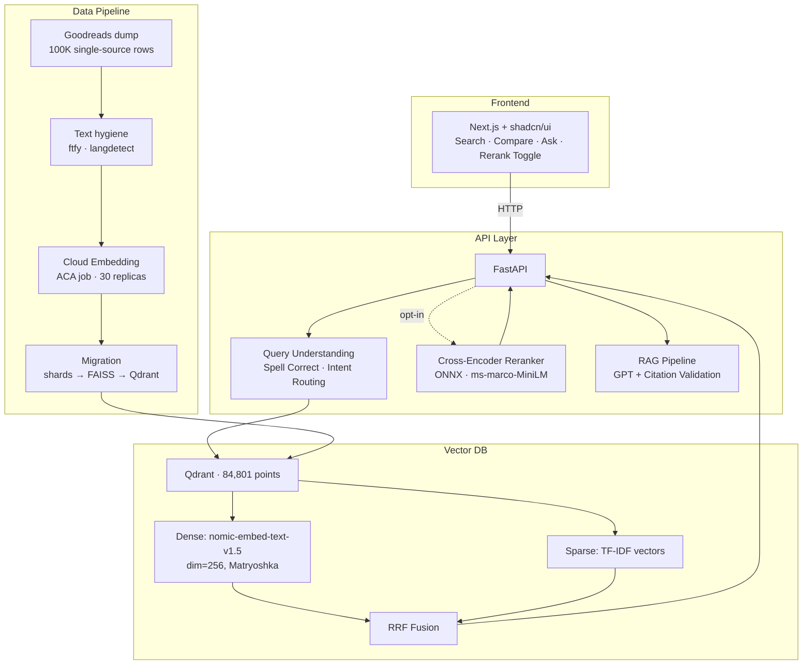
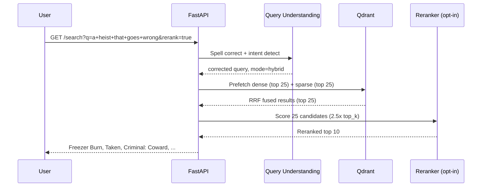
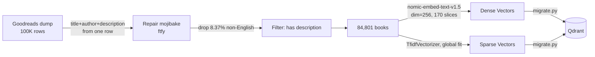
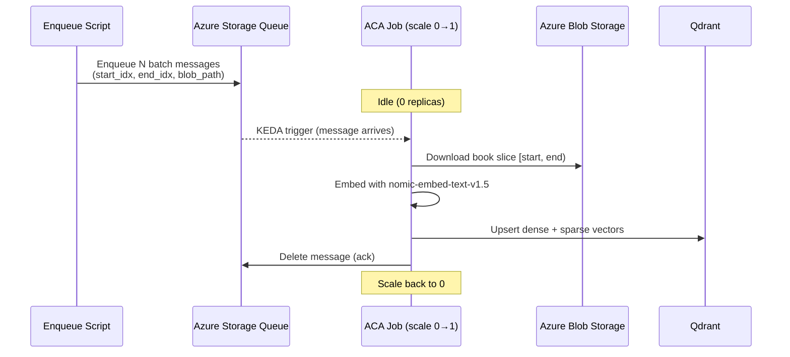

# 📚 BookSearch — Hybrid Semantic Search Engine

### **[▶ Try it live](https://black-grass-0df1c7a0f.7.azurestaticapps.net/)** · [API docs](https://booksearch-api.thankfulstone-e6f7cf40.eastus.azurecontainerapps.io/docs) · [Evaluation](docs/EVALUATION.md)

Search 84,801 books by what they are *about*, not what they are called. Ask for *"a heist that goes wrong"* and the top hits are *Freezer Burn* and *Criminal: Coward* — neither shares a single word with the query.

Under the hood: TF-IDF sparse retrieval fused with dense vector search (nomic-embed-text-v1.5) via Reciprocal Rank Fusion, plus an optional cross-encoder reranker — self-hosted on Qdrant, deployed to Azure Container Apps with full CI/CD.

Every quality claim below is measured against the live deployment and [reproducible from this repo](docs/EVALUATION.md#reproducing) — including the ones that came out badly.

---

## Architecture



<details>
<summary><b>Query Flow</b> — a search request through fusion and reranking</summary>



</details>

<details>
<summary><b>ETL Pipeline</b> — how 100K raw rows become 84,801 indexed books</summary>



Every field comes from the same source row, so a description can never be attached to
another author's book — the whole reason for the migration ([Corpus History](docs/CORPUS_HISTORY.md)).

</details>

<details>
<summary><b>Embedding Worker</b> — event-driven, scale-to-zero batch embedding</summary>



</details>

---

## Tech Stack

| Layer | Technology |
|-------|-----------|
| **Frontend** | Next.js 16, TypeScript, Tailwind CSS, shadcn/ui |
| **API** | FastAPI, Python 3.11, Pydantic |
| **Vector DB** | Qdrant (self-hosted, Docker) |
| **Embeddings** | nomic-embed-text-v1.5 (Matryoshka, dim=256) |
| **Sparse Retrieval** | TF-IDF (scikit-learn) |
| **Reranker** | cross-encoder/ms-marco-MiniLM-L-6-v2 (ONNX Runtime) |
| **RAG** | Azure OpenAI (GPT) with citation validation |
| **Query Understanding** | SymSpell (spell correction) + intent routing |
| **Cloud Infra** | Azure Container Instances, ACR, Blob Storage |
| **IaC** | Bicep (ACA templates ready) |

---

## Features

- **Hybrid Search (RRF)** — Reciprocal Rank Fusion of TF-IDF + dense vectors: keyword precision plus semantic understanding.
- **Cross-Encoder Reranker** — Optional two-stage retrieval, ONNX-optimized for CPU with length-bucketed batching. Opt-in because it costs ~2.2 s; see [where it helps most](docs/EVALUATION.md#where-reranking-helps).
- **Query Understanding** — Spell correction (SymSpell), intent detection, query-adaptive mode routing.
- **RAG with Guardrails** — Natural language Q&A grounded in retrieved books. Citation validation prevents hallucinated titles.
- **Compare View** — Side-by-side 3-column comparison of keyword vs. hybrid vs. vector results.
- **Evaluation Framework** — Two independent harnesses (graded relevance with paired bootstrap CIs, and an objective known-item gate), an LLM judge validated against 89 hand-labeled pairs, and a [GitHub Actions workflow](.github/workflows/eval.yml) that runs the whole pipeline remotely.

---

## Eval Results

Two independent harnesses, both run against the live production deployment: a
**graded relevance eval** (100 corpus-grounded queries, **5,000 LLM-judged pairs**,
zero unjudged, paired bootstrap confidence intervals) and an objective
**known-item eval** (exact-title lookup — no judge, no pooling, verifiable by hand).

> Full methodology, per-category breakdowns, judge validation and limitations:
> **[docs/EVALUATION.md](docs/EVALUATION.md)** · corpus history and the v1 data bug:
> **[docs/CORPUS_HISTORY.md](docs/CORPUS_HISTORY.md)**

### Retrieval Quality (k=10, v2 84,801-book corpus, n=98)

| Mode | MRR@10 | NDCG@10 | Recall@10 | Median latency |
|------|--------|---------|-----------|----------------|
| Keyword (TF-IDF) | 0.889 [0.832, 0.937] | 0.633 [0.582, 0.682] | 0.331 [0.283, 0.380] | 141 ms |
| Vector (nomic-256d) | 0.951 [0.910, 0.986] | 0.750 [0.710, 0.790] | 0.392 [0.345, 0.441] | 212 ms |
| Hybrid (RRF) | 0.953 [0.915, 0.985] | 0.754 [0.714, 0.793] | 0.414 [0.361, 0.471] | **216 ms** |
| **Hybrid + Rerank** | **0.982 [0.954, 1.000]** | **0.835 [0.799, 0.865]** | **0.450 [0.398, 0.501]** | 2,158 ms |

Paired deltas (bootstrap over per-query differences, all six intervals exclude zero):

| Comparison | NDCG@10 | 95% CI |
|------------|---------|--------|
| Hybrid − Keyword | **+0.121** | [+0.087, +0.158] |
| Hybrid+Rerank − Hybrid | **+0.081** | [+0.054, +0.110] |
| Hybrid+Rerank − Keyword | **+0.202** | [+0.159, +0.250] |

*0.982 counts grade ≥ 1 as relevant. Under a strict grade-2 bar it is **0.958 against
a 0.231 random baseline** — a 4.1× lift, and reranking's margin over hybrid grows
rather than shrinks ([why](docs/EVALUATION.md#threshold-sensitivity-what-0982-actually-means)).*

### Known-Item Accuracy (50 titles sampled from the v2 index)

| Mode | Acc@1 | Acc@5 | MRR |
|------|-------|-------|-----|
| **Vector (nomic-256d)** | **94%** | 96% | 0.950 |
| Hybrid (RRF) | 86% | **98%** | 0.917 |
| Keyword (TF-IDF) | 66% | 80% | 0.732 |

No judge, no pooling — sample a title from the index, search it, check whether that
book comes back first. Anyone can verify it by hand. Reranking takes hybrid to **98%
with zero regressions across 80 paired queries**
([paired test](docs/EVALUATION.md#reranking-on-v2-a-paired-test)), and this harness
gates every deploy: the build fails if either arm drops 5 points below baseline.

### Key Findings

- **Hybrid is not strictly better than dense here.** Pure vector wins known-item
  Acc@1 **94% vs 86%** — RRF buys recall and pays for it in top-1 precision.
- **Reranking's margin grows nearly 4x under a stricter relevance bar**
  (+0.029 to +0.114). Lenient thresholds systematically understate it.
- **8 of 40 queries returned a different #1 book** on byte-identical requests until
  an RRF score-tie bug was fixed. Fusion is structurally exposed to this; dense
  retrieval is not.
- **56% of the remaining headroom is retrieval, not ranking.** A perfect reranker
  over the same candidates would reach 0.940 against hybrid's 0.754.
- **An earlier eval measured its own query set**, not the system — LLM-written
  queries that no document in the index could answer.

**[Full reasoning, evidence and caveats -> docs/EVALUATION.md](docs/EVALUATION.md#key-findings)**


### The Short Version of the Caveats

The LLM judge agrees with a human only **~2/3 of the time** (Cohen's kappa **0.314**),
and every graded number rests on that. **Recall is capped at 0.559** by pooling, so it
is not comparable across systems. **Per-category results are underpowered** — `author`
(n=13) and `combined` (n=9) have intervals that include zero. The corpus was migrated
after a **12.8%-floor description-provenance defect** was found by hand-labeling, a bug
the automated eval was structurally blind to.

All expanded, with the reasoning, in [docs/EVALUATION.md](docs/EVALUATION.md) and
[docs/CORPUS_HISTORY.md](docs/CORPUS_HISTORY.md).

---

## Getting Started

### Prerequisites

- Python 3.11+
- Docker (for Qdrant)
- Node.js 18+ / pnpm (for frontend)

### Quick Start

```bash
# 1. Clone and install
git clone https://github.com/TruaShamu/ai-search.git
cd ai-search
pip install -r requirements.txt
cp .env.example .env    # then fill in values

# 2. Start Qdrant
docker run -d --name qdrant -p 6333:6333 -v qdrant_storage:/qdrant/storage qdrant/qdrant:latest

# 3. Run migration (loads data into Qdrant) -- see note below
python -m src.qdrant.migrate --qdrant-url http://localhost:6333 --collection books --recreate

# 4. Start API
export QDRANT_URL=http://localhost:6333
uvicorn src.api.main:app --host 0.0.0.0 --port 8000

# 5. Start frontend
cd web && pnpm install && pnpm dev
```

Open http://localhost:3000, or check the API directly:

```bash
curl "http://localhost:8000/search?q=a+heist+that+goes+wrong&mode=hybrid&rerank=true"
curl -X POST http://localhost:8000/ask -H "Content-Type: application/json" \
  -d '{"question": "What are some good books about Scottish history?"}'
```

Every endpoint, parameter and response schema is auto-generated by FastAPI and always
matches the running build — locally at `/docs`, or on the
[deployed API](https://booksearch-api.thankfulstone-e6f7cf40.eastus.azurecontainerapps.io/docs).

> **Step 3 needs index artifacts that are not in git.** `migrate.py` reads `data/index/{faiss.index,metadata.jsonl}` (~190 MB) and the corpus under `data/processed/` (~106 MB); both are gitignored, so a fresh clone fails here with a missing-file error. Either skip steps 2–4 and point `NEXT_PUBLIC_API_URL` in `web/.env.local` at the deployed API, or rebuild the index from the [UCSD Goodreads dataset](https://cseweb.ucsd.edu/~jmcauley/datasets/goodreads.html) via `python -m src.indexing.worker` and `python -m src.indexing.assemble` — see [Corpus History](docs/CORPUS_HISTORY.md) for how it was filtered.
>
> The test suite (`python -m pytest tests/`) mocks external services and runs on a clean clone with no data or credentials.

### Environment Variables

Copy `.env.example` to `.env` and fill it in — it lists every variable the project reads, with defaults and notes. The ones that matter for a local run:

| Variable | Description | Default |
|----------|-------------|---------|
| `QDRANT_URL` | Qdrant server URL | `http://localhost:6333` |
| `QDRANT_COLLECTION` | Collection name | `books` |
| `AZURE_OPENAI_ENDPOINT` | For the RAG `/ask` endpoint, the LLM judge, and query generation | — |
| `AZURE_OPENAI_KEY` | For the RAG `/ask` endpoint, the LLM judge, and query generation | — |
| `AZURE_OPENAI_DEPLOYMENT` | Chat deployment name | `gpt-54-nano` |
| `EVAL_API_URL` | Target for the eval harnesses | deployed URL |

> The deployed container also sets `AZURE_OPENAI_API_KEY` to the same secret. Only `AZURE_OPENAI_KEY` is read by the code; the alias exists because the two names are easy to confuse and a mismatch is easy to miss — `/ask` returns a 502 with the failure detail rather than taking the service down, and search keeps working.

---

## Project Structure

`src/` is the system: one package each for the API, Qdrant client, embedding
model, indexing pipeline, reranker, RAG, query understanding, eval framework and
ETL. `scripts/` is what operates on it — the eval harnesses CI runs and the
corpus-validation analyses — so nothing deployed lives there.
[`web/`](web/README.md) is the Next.js frontend, `infra/` the Bicep templates, and
`data/` the corpus, eval sets and ONNX model.

The indexing pipeline is the substantial part: `src/indexing/worker.py` runs as a
queue-driven Azure Container Apps job that scales 0→30 replicas, each embedding
one slice of the corpus, and `src/indexing/assemble.py` stitches the resulting
shards into the FAISS index and metadata that `src/qdrant/migrate.py` loads.

### Documentation

| Document | Contents |
|---|---|
| [docs/EVALUATION.md](docs/EVALUATION.md) | Full eval methodology, all result tables, threshold sensitivity, judge validation, limitations, and how to reproduce |
| [docs/CORPUS_HISTORY.md](docs/CORPUS_HISTORY.md) | Where the data came from, the v1 description-provenance bug, what the v2 migration changed, and the archived v1 results |
| [docs/embedding-model-selection.md](docs/embedding-model-selection.md) | Six embedding models compared on MTEB retrieval, CPU throughput, size and Matryoshka support, and why the 274 MB model beat the 900 MB one |

One further document — [embedding-strategy.md](docs/embedding-strategy.md) — predates
the corpus migration and is kept for a specific reason: its status banner maps what the
embedding template was designed to do against what the v2 index actually embeds,
including the field branches that are now permanently empty.

---

## Design Decisions

| Decision | Rationale |
|----------|-----------|
| **Qdrant over Azure AI Search** | Measured 15x faster at migration time (24ms vs 370ms), plus no tier limits, built-in RRF, and self-hosting. The Azure resource is since decommissioned, so that number is no longer re-runnable |
| **TF-IDF over BM25** | Sufficient at the current scale; hybrid compensates. BM25's length norm matters more as the index grows — at 84.8K docs this is now the closest call in the table and the most likely next change |
| **Matryoshka dim=256** | nomic-embed-text-v1.5 trained checkpoints: 768/512/256/128/64. 256 balances quality vs. index size |
| **Reranker opt-in** | ~1.8s of cross-encoder time, down from ~3.6s after length-bucketed batching. The quality gain is real and reproduced two independent ways ([results](#eval-results)), but it is still too slow to impose on every search, so it is off by default and toggleable per query |
| **English-only index** | Measured: a Spanish translation scores 0.635 against an English query where an English paraphrase scores 0.787 and an unrelated English sentence scores 0.274 — foreign text outranks genuine matches, and the English-only reranker cannot fix it |
| **ONNX reranker** | 3.7x faster than PyTorch on CPU (23ms vs 86ms for 4 candidates) |
| **Cloud embedding (ACA job)** | Local GPU unavailable. 30 parallel replicas embed 84.8K docs in ~50 min. Each reads one pre-cut slice blob rather than the whole corpus: measured +4.9 MB resident vs +429 MB, which is what fixed the OOMKill |
| **Liveness split from readiness** | `/health` stays 200 while the process is up, but `/ready` returns 503 until the models finish loading — so ingress routes around a replica that is running yet still ~20s from being able to answer |

---

## License

MIT
