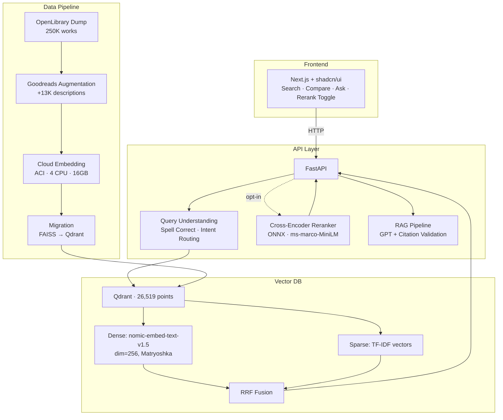
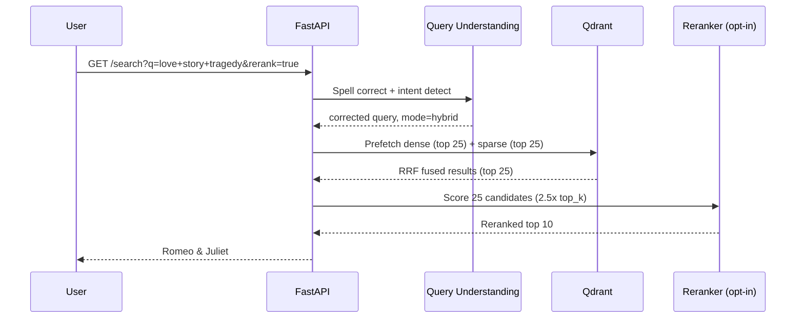
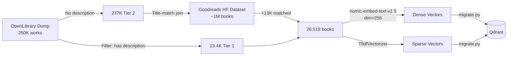
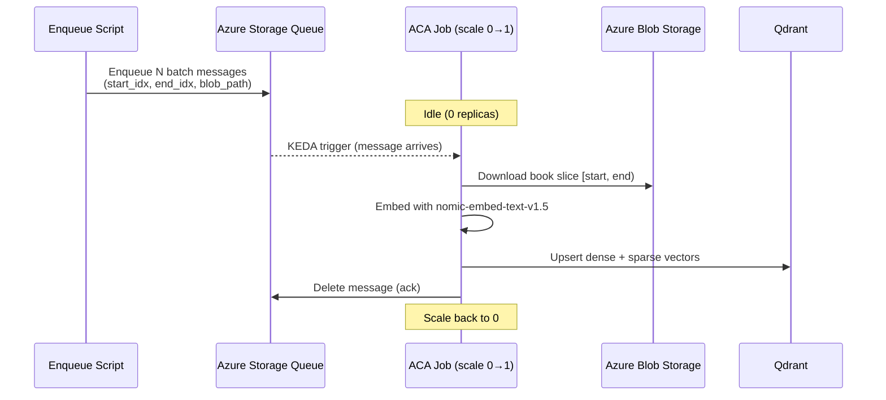

# 📚 BookSearch — Hybrid Semantic Search Engine

A hybrid search engine over 26,500+ books from the OpenLibrary catalog. Combines TF-IDF sparse retrieval with dense vector search (nomic-embed-text-v1.5) using Reciprocal Rank Fusion, plus an optional cross-encoder reranker — all self-hosted on Qdrant and deployed to Azure Container Apps with full CI/CD.

Built as a portfolio piece demonstrating **backend + ML infrastructure engineering**.

---

## Architecture



### Query Flow



### Data Pipeline



### Embedding Worker (Event-Driven)



---

## Tech Stack

| Layer | Technology |
|-------|-----------|
| **Frontend** | Next.js 16, TypeScript, Tailwind CSS, shadcn/ui |
| **API** | FastAPI, Python 3.11, Pydantic |
| **Vector DB** | Qdrant (self-hosted, Docker) |
| **Embeddings** | nomic-embed-text-v1.5 (Matryoshka, dim=256) |
| **Sparse Retrieval** | TF-IDF (scikit-learn) |
| **Reranker** | cross-encoder/ms-marco-MiniLM-L-6-v2 (ONNX Runtime) |
| **RAG** | Azure OpenAI (GPT) with citation validation |
| **Query Understanding** | SymSpell (spell correction) + intent routing |
| **Cloud Infra** | Azure Container Instances, ACR, Blob Storage |
| **IaC** | Bicep (ACA templates ready) |

---

## Features

- **Hybrid Search (RRF)** — Reciprocal Rank Fusion of TF-IDF + dense vectors. Best of both worlds: keyword precision + semantic understanding.
- **Cross-Encoder Reranker** — Optional two-stage retrieval. ONNX-optimized for CPU. Measured at +0.097 NDCG over hybrid; available as a toggle because it costs ~3.3s — see eval findings below for where it helps most.
- **Query Understanding** — Spell correction (SymSpell), intent detection, query-adaptive mode routing.
- **RAG with Guardrails** — Natural language Q&A grounded in retrieved books. Citation validation prevents hallucinated titles.
- **Compare View** — Side-by-side 3-column comparison of keyword vs. hybrid vs. vector results.
- **Evaluation Framework** — Two independent harnesses: a graded relevance eval with paired bootstrap confidence intervals (MRR@10, NDCG@10, Recall@10) via `scripts/eval_redesign.py`, and a corpus-sampled known-item accuracy gate via `python -m src.eval.known_item_eval`. Limitations are documented rather than glossed over.

---

## Eval Results

Evaluated on **100 corpus-grounded queries** against the live production deployment, with **5,000 query–document pairs** LLM-judged on a graded 0/1/2 scale and **zero unjudged pairs**. Confidence intervals are 1,000-replicate percentile bootstraps; mode comparisons use a **paired** bootstrap on per-query deltas. Reproducible via `python scripts/eval_redesign.py --step all`.

Six queries (all `author`) were dropped for having no relevant document in the pool, leaving **n=94** evaluated across every mode.

### Retrieval Quality (k=10, 26.5K corpus)

| Mode | MRR@10 | NDCG@10 | Recall@10 | Median Latency |
|------|--------|---------|-----------|----------------|
| Keyword (TF-IDF) | 0.851 [0.784, 0.911] | 0.593 [0.534, 0.649] | 0.440 [0.370, 0.508] | 131ms |
| Vector (nomic-256d) | 0.896 [0.841, 0.946] | 0.698 [0.648, 0.743] | 0.514 [0.451, 0.569] | 213ms |
| **Hybrid (RRF)** | 0.910 [0.858, 0.954] | 0.703 [0.660, 0.749] | 0.523 [0.459, 0.590] | **209ms** |
| **Hybrid + Rerank** | **0.985 [0.962, 1.000]** | **0.801 [0.769, 0.835]** | **0.583 [0.525, 0.641]** | 3,268ms |

Recall@10 is bounded above by **0.794** on average, because a pool can hold more than ten relevant documents while only ten can be returned.

### Paired Comparisons

Bootstrapping per-query *differences* rather than comparing independent means removes query-difficulty variance, which is what makes these gaps resolvable at n=94.

| Comparison | NDCG@10 delta | 95% CI | MRR@10 delta | 95% CI |
|------------|---------------|--------|--------------|--------|
| Hybrid − Keyword | **+0.111** | [+0.079, +0.146] | +0.059 | [+0.014, +0.112] |
| Hybrid+Rerank − Hybrid | **+0.097** | [+0.060, +0.135] | +0.075 | [+0.026, +0.125] |
| Hybrid+Rerank − Keyword | **+0.208** | [+0.159, +0.260] | +0.134 | [+0.072, +0.197] |

All six intervals exclude zero. Eleven unadjusted intervals were computed in total, so roughly 0.6 would be expected to exclude zero by chance; the observed effects are far larger than that.

### Where Reranking Helps

| Category | n | Hybrid NDCG | +Rerank | Delta | 95% CI |
|----------|---|-------------|---------|-------|--------|
| author | 12 | 0.750 | 0.886 | +0.136 | [+0.030, +0.277] |
| combined | 10 | 0.832 | 0.831 | −0.000 | [−0.146, +0.139] |
| exploratory | 21 | 0.693 | 0.806 | +0.113 | [+0.042, +0.193] |
| genre_topic | 32 | 0.647 | 0.739 | +0.092 | [+0.039, +0.143] |
| title_lookup | 19 | 0.713 | 0.829 | +0.116 | [+0.051, +0.200] |

Reranking helps everywhere except **combined** filter-style queries, where hybrid already scores 0.83 and the interval spans zero. Only `genre_topic` clears n=30; the rest are underpowered individually and should be read as directional.

### Ceiling Analysis

A perfect reranker over the same 25-candidate pool would score **0.917** NDCG against hybrid's **0.703** — headroom of **+0.214**. The cross-encoder captures **+0.097**, or about **45%** of what is theoretically available at that depth. The remaining gap is a retrieval problem, not a ranking one: it can only be closed by getting better candidates into the pool.

### Known-Item Accuracy (50 titles sampled from the corpus)

A second, independent eval: sample a book from the index, search its exact title, check whether that book comes back first. No LLM judge, no pooling, no subjective grading — the answer is either right or wrong, and anyone can verify it by hand in a few seconds.

| Mode | Accuracy@1 |
|------|-----------|
| **Vector (nomic-256d)** | **100%** |
| Hybrid (RRF) | 94% |
| Keyword (TF-IDF) | 74% |

Keyword's failures are concentrated, not random: **81%** accuracy on distinctive titles vs **38%** on titles made of common words. Searching "Crazy little thing" by keyword returns *Serial*, *Crazy Horse*, *Crazy Horse* — the exact match never surfaces. This is inherent to lexical scoring, not an indexing defect.

The same harness also runs 29 **hard variants** — typos, partial titles, and title-plus-author forms — as a robustness check:

| Mode | Acc@1 | Acc@5 |
|------|-------|-------|
| Hybrid (RRF) | 72% | **93%** |
| Vector | 79% | 90% |
| Keyword (TF-IDF) | 66% | 86% |

Degradation is graceful rather than catastrophic, and hybrid has the best top-5 recovery. This eval doubles as a CI regression gate: it fails the build if hybrid accuracy drops more than 5 points below the recorded baseline (`python -m src.eval.known_item_eval`).

### Key Findings

- **Hybrid beats keyword, and this time the data supports it.** An earlier version of this eval put the gap at 0.003 MRR against a standard error near 0.07 — indistinguishable from noise. That result was an artifact: the query set had been generated by an LLM with no view of the corpus, producing canonical titles (*1984*, *The Great Gatsby*) against an index of mostly obscure OpenLibrary works, and carrying no gold documents. On corpus-grounded queries the margin is **+0.111 NDCG [+0.079, +0.146]**.
- **Cross-encoder reranking helps, and the earlier finding that it hurt was caused by a bug in my own code.** `onnx_reranker.py` truncated every passage at `[:300]` characters, discarding **60.2% of all description text across 62% of documents** (median description length is 477 characters, 90th percentile 1,289). The cross-encoder was scoring fragments while RRF fused the full index. With truncation fixed, reranking gains **+0.097 NDCG [+0.060, +0.135]** over hybrid and lifts MRR to **0.985** — it puts a relevant book first almost every time.
- **Fixing the quality bug exposed a capacity bug that had been hiding behind it.** Full-length passages take the cross-encoder from ~93 tokens to ~335. On the original 1 vCPU container that pushed `rerank=true` past the ingress timeout: 3 of 6 requests failed and one took 98 seconds. The API now runs on 2 vCPU with a readiness probe, where reranking is 10/10 successful at a 3.3s median. Truncation had been masking the fact that the container could not afford the work.
- **Dense retrieval is stronger than lexical here, and both evals now agree.** Vector beats keyword by +0.105 NDCG in the graded eval and 100% vs 74% on known-item. The previous claim that "vector alone underperforms keyword" came from a pool built from keyword-friendly candidates that stored no negatives, so dense retrieval was penalized for surfacing books the pool had never judged.

> Reranking stays an **opt-in toggle** rather than a default. The quality gain is real, but 3.3s is too slow to impose on every search when plain hybrid answers in ~209ms. It is worth the wait on exploratory queries — "love story tragedy" returns Romeo & Juliet first with reranking on.

### Known Limitations of This Eval

Stated plainly, because they bound what the tables above can support:

- **The judge is unvalidated by a human.** Relevance labels come from a zero-shot `gpt-5.4-nano` judge, and the richer calibrated judge in `src/eval/judge.py` is not what produced them — `scripts/eval_redesign.py` uses its own simpler prompt. Closing this gap is a single command: `python -m src.eval.label` samples judged pairs, hides the machine's grade, and collects your own labels, then `python -m src.eval.judge --agreement data/eval/v2/judgments.json data/eval/v2/human.json` reports Cohen's kappa and Krippendorff's alpha against them. **Until that has been run, every number above rests on one model's definition of relevance.**
- **Query generation and judging share a model family,** so blind spots may be correlated rather than independent. This bears most directly on the reranking result: a cross-encoder and an LLM judge may both reward surface semantic similarity, which would inflate the measured gain. **The reranking number is the one most in need of human validation.**
- **Per-category results are underpowered.** Four of five categories have n < 30 and are flagged accordingly. Only `genre_topic` (n=32) is individually well-powered.
- **Recall is capped by construction** at a mean ceiling of 0.794, so recall figures are not comparable to systems evaluated with complete relevance judgments.
- **Documents outside the judged pool count as non-relevant.** This is standard for pooled evaluation, and was verified not to penalize reranking: across sampled queries, **0 of 120** reranked top-10 documents fell outside the pool.
- **Six author queries were dropped** for having no relevant document, which slightly biases that category toward the queries the system could already answer.

A second, independent eval: sample a book from the index, search its exact title, check whether that book comes back first. No LLM judge, no pooling, no subjective grading — the answer is either right or wrong, and anyone can verify it by hand in a few seconds.

| Mode | Accuracy@1 |
|------|-----------|
| **Vector (nomic-256d)** | **100%** |
| Hybrid (RRF) | 94% |
| Keyword (TF-IDF) | 74% |

Keyword's failures are concentrated, not random: **81%** accuracy on distinctive titles vs **38%** on titles made of common words. Searching "Crazy little thing" by keyword returns *Serial*, *Crazy Horse*, *Crazy Horse* — the exact match never surfaces. This is inherent to lexical scoring, not an indexing defect.

The same harness also runs 29 **hard variants** — typos, partial titles, and title-plus-author forms — as a robustness check:

| Mode | Acc@1 | Acc@5 |
|------|-------|-------|
| Hybrid (RRF) | 72% | **93%** |
| Vector | 79% | 90% |
| Keyword (TF-IDF) | 66% | 86% |

Degradation is graceful rather than catastrophic, and hybrid has the best top-5 recovery. This eval doubles as a CI regression gate: it fails the build if hybrid accuracy drops more than 5 points below the recorded baseline (`python -m src.eval.known_item_eval`).

---

## Getting Started

### Prerequisites

- Python 3.11+
- Docker (for Qdrant)
- Node.js 18+ / pnpm (for frontend)

### Quick Start

```bash
# 1. Clone and install
git clone https://github.com/TruaShamu/ai-search.git
cd ai-search
pip install -r requirements.txt

# 2. Start Qdrant
docker run -d --name qdrant -p 6333:6333 -v qdrant_storage:/qdrant/storage qdrant/qdrant:latest

# 3. Run migration (loads data into Qdrant)
python -m src.qdrant.migrate --qdrant-url http://localhost:6333 --collection books --recreate

# 4. Start API
export QDRANT_URL=http://localhost:6333
uvicorn src.api.main:app --host 0.0.0.0 --port 8000

# 5. Start frontend
cd web && pnpm install && pnpm dev
```

Open http://localhost:3000

### Environment Variables

| Variable | Description | Default |
|----------|-------------|---------|
| `QDRANT_URL` | Qdrant server URL | `http://localhost:6333` |
| `QDRANT_COLLECTION` | Collection name | `books` |
| `AZURE_OPENAI_ENDPOINT` | For RAG /ask endpoint | — |
| `AZURE_OPENAI_API_KEY` | For RAG /ask endpoint | — |

---

## Project Structure

```
src/
├── api/            FastAPI application (search, ask, health, stats)
├── qdrant/         Qdrant client (hybrid search) + migration script
├── search/         Embedding pipeline (nomic-embed-text-v1.5)
├── reranker/       Cross-encoder reranker (ONNX + PyTorch fallback)
├── rag/            RAG generation with hallucination guardrails
├── query/          Query understanding (spell, intent, expansion)
├── eval/           Evaluation framework (MRR, NDCG, Recall, known-item, LLM judge)
└── etl/            Data pipelines (OpenLibrary + Goodreads augmentation)

web/                Next.js frontend (search UI, compare view, ask tab)
infra/              Bicep templates (ACA deployment)
scripts/            Cloud embedding automation + eval harnesses
data/
├── processed/      Augmented catalog (books_augmented.jsonl)
├── index/          Legacy FAISS index + TF-IDF vectorizer (pre-Qdrant; kept for the migration script only)
├── eval/           Evaluation datasets + results
└── models/         ONNX reranker model
```

---

## Design Decisions

| Decision | Rationale |
|----------|-----------|
| **Qdrant over Azure AI Search** | Measured 15x faster at the time of migration (24ms vs 370ms), plus no tier limits, built-in RRF, and self-hosting. The Azure resource has since been decommissioned, so that comparison is no longer reproducible from this repo |
| **TF-IDF over BM25** | Sufficient at 26K scale; hybrid compensates. BM25's length norm matters more at >100K docs |
| **Matryoshka dim=256** | nomic-embed-text-v1.5 trained checkpoints: 768/512/256/128/64. 256 balances quality vs. index size |
| **Reranker opt-in** | Adds ~3.3s but gains +0.097 NDCG [+0.060, +0.135] over hybrid. Too slow to impose on every search, so it is off by default and toggleable per query |
| **Goodreads augmentation** | OpenLibrary lacks descriptions for 95% of books. Title-match join doubled the corpus |
| **ONNX reranker** | 3.7x faster than PyTorch on CPU (23ms vs 86ms for 4 candidates) |
| **Cloud embedding (ACI)** | Local GPU unavailable; 4-CPU ACI with 16GB RAM handles 26K docs in ~3h |
| **API at 2 vCPU, always-on** | Measured, not guessed. At 1 vCPU with `minReplicas: 0`, removing the reranker's passage truncation pushed `rerank=true` past the ingress timeout (3/6 requests failed, one took 98s), and the first request after idle paid a ~20s model load. Separate liveness (`/health`) and readiness (`/ready`) probes stop ingress routing to replicas that are still loading |

---

## API Endpoints

| Endpoint | Method | Description |
|----------|--------|-------------|
| `/search` | GET | Hybrid search with mode, rerank, filters |
| `/search/compare` | GET | Side-by-side results across all modes |
| `/ask` | POST | RAG question answering with citations |
| `/health` | GET | Liveness probe — reports backend, model warmup state, and reranker availability. Always 200 while the process is up |
| `/ready` | GET | Readiness probe — 503 until models finish loading, so ingress skips cold replicas |
| `/stats` | GET | Index statistics |

### Example

```bash
# Hybrid search
curl "http://localhost:8000/search?q=scottish+romance&mode=hybrid&top_k=5"

# With reranking
curl "http://localhost:8000/search?q=love+story+tragedy&rerank=true"

# RAG question
curl -X POST http://localhost:8000/ask \
  -H "Content-Type: application/json" \
  -d '{"question": "What are some good books about Scottish history?"}'
```

---

## License

MIT
