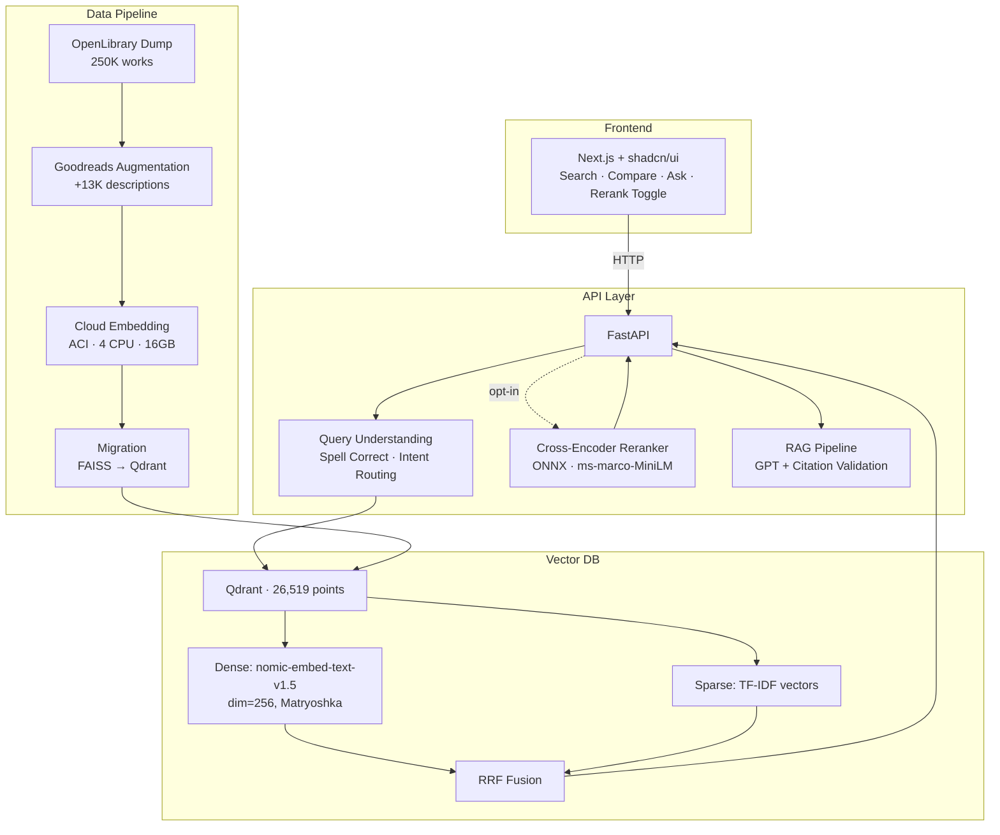
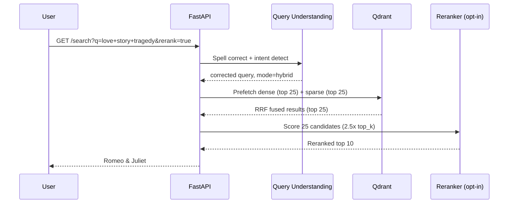
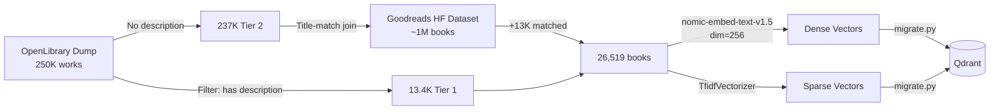
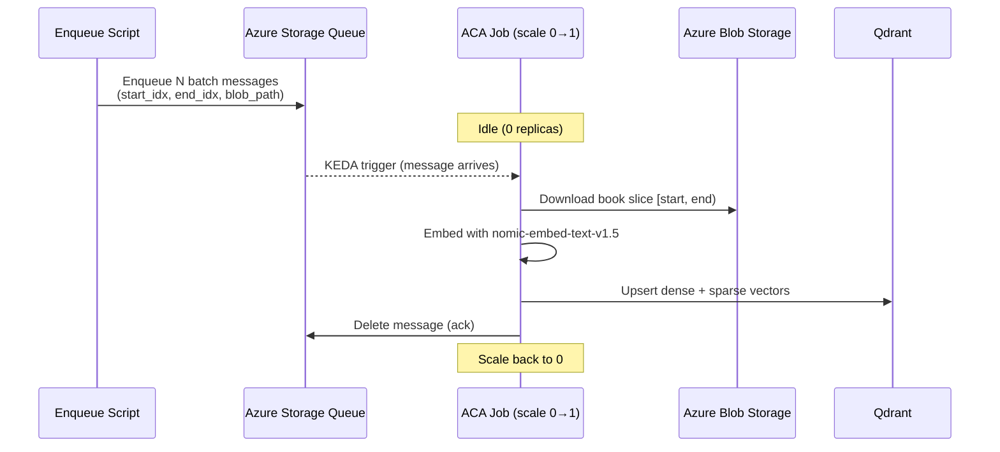

# 📚 BookSearch — Hybrid Semantic Search Engine

A hybrid search engine over 26,500+ books from the OpenLibrary catalog. Combines TF-IDF sparse retrieval with dense vector search (nomic-embed-text-v1.5) using Reciprocal Rank Fusion, plus an optional cross-encoder reranker — all self-hosted on Qdrant and deployed to Azure Container Apps with full CI/CD.

Built as a portfolio piece demonstrating **backend + ML infrastructure engineering**.

---

## Architecture



### Query Flow



### Data Pipeline



### Embedding Worker (Event-Driven)



---

## Tech Stack

| Layer | Technology |
|-------|-----------|
| **Frontend** | Next.js 16, TypeScript, Tailwind CSS, shadcn/ui |
| **API** | FastAPI, Python 3.11, Pydantic |
| **Vector DB** | Qdrant (self-hosted, Docker) |
| **Embeddings** | nomic-embed-text-v1.5 (Matryoshka, dim=256) |
| **Sparse Retrieval** | TF-IDF (scikit-learn) |
| **Reranker** | cross-encoder/ms-marco-MiniLM-L-6-v2 (ONNX Runtime) |
| **RAG** | Azure OpenAI (GPT) with citation validation |
| **Query Understanding** | SymSpell (spell correction) + intent routing |
| **Cloud Infra** | Azure Container Instances, ACR, Blob Storage |
| **IaC** | Bicep (ACA templates ready) |

---

## Features

- **Hybrid Search (RRF)** — Reciprocal Rank Fusion of TF-IDF + dense vectors. Best of both worlds: keyword precision + semantic understanding.
- **Cross-Encoder Reranker** — Optional two-stage retrieval. ONNX-optimized for CPU. Available as a toggle — see eval findings below on when it helps vs. hurts.
- **Query Understanding** — Spell correction (SymSpell), intent detection, query-adaptive mode routing.
- **RAG with Guardrails** — Natural language Q&A grounded in retrieved books. Citation validation prevents hallucinated titles.
- **Compare View** — Side-by-side 3-column comparison of keyword vs. hybrid vs. vector results.
- **Evaluation Framework** — Two independent harnesses: a graded relevance eval (MRR@10, NDCG@10, Recall@10) via `scripts/eval_via_api.py`, and a corpus-sampled known-item accuracy gate via `python -m src.eval.known_item_eval`. Limitations are documented rather than glossed over.

---

## Eval Results

Evaluated on a 30-query labeled dataset (LLM-judged relevance, graded 0/1/2) against the live production deployment. Reproducible via `python scripts/eval_via_api.py`.

> **Read the caveats before quoting these numbers.** At n=30 the standard error on MRR is roughly ±0.07, so only large gaps are meaningful. The judged pool was also built from an earlier backend and kept only documents already scored relevant, which biases it toward keyword retrieval. See [Known Limitations](#known-limitations-of-this-eval).

### Retrieval Quality (k=10, 26.5K corpus)

| Mode | MRR@10 | NDCG@10 | Recall@10 | Avg Latency |
|------|--------|---------|-----------|-------------|
| Keyword (TF-IDF) | 0.662 | 0.354 | 0.282 | 73ms |
| Vector (nomic-256d) | 0.625 | 0.295 | 0.205 | 45ms |
| **Hybrid (RRF)** | **0.665** | **0.385** | **0.306** | 76ms |
| Hybrid + Rerank | 0.611 | 0.370 | 0.273 | 4340ms |

### Known-Item Accuracy (50 titles sampled from the corpus)

A second, independent eval: sample a book from the index, search its exact title, check whether that book comes back first. No LLM judge, no pooling, no subjective grading — the answer is either right or wrong, and anyone can verify it by hand in a few seconds.

| Mode | Accuracy@1 |
|------|-----------|
| **Vector (nomic-256d)** | **100%** |
| Hybrid (RRF) | 94% |
| Keyword (TF-IDF) | 74% |

Keyword's failures are concentrated, not random: **81%** accuracy on distinctive titles vs **38%** on titles made of common words. Searching "Crazy little thing" by keyword returns *Serial*, *Crazy Horse*, *Crazy Horse* — the exact match never surfaces. This is inherent to lexical scoring, not an indexing defect.

The same harness also runs 29 **hard variants** — typos, partial titles, and title-plus-author forms — as a robustness check:

| Mode | Acc@1 | Acc@5 |
|------|-------|-------|
| Hybrid (RRF) | 72% | **93%** |
| Vector | 79% | 90% |
| Keyword (TF-IDF) | 66% | 86% |

Degradation is graceful rather than catastrophic, and hybrid has the best top-5 recovery. This eval doubles as a CI regression gate: it fails the build if hybrid accuracy drops more than 5 points below the recorded baseline (`python -m src.eval.known_item_eval`).

### Key Findings

- **Hybrid is the mode to ship,** but the graded eval cannot prove it beats keyword. The MRR gap is 0.003 against a standard error near 0.07 — indistinguishable from noise. The honest support for hybrid is the NDCG/recall margin plus the known-item result, where hybrid scores 94% and keyword 74%.
- **Cross-encoder reranking measurably hurt — and the cause turned out to be a bug in my own code, not the model.** The original explanation here blamed book metadata for being too sparse to rerank. That was wrong. `onnx_reranker.py` truncated every passage at `[:300]` characters, discarding **60.2% of all description text across 62% of documents** (descriptions run to a median of 477 characters and a 90th percentile of 1,289). The cross-encoder was scoring truncated fragments while RRF fused the full index — so the comparison was never fair to the reranker. The truncation is fixed, but **the table above still reflects the old code**, and will not be updated until the fix is redeployed and re-measured. Longer passages will also make the 4.3s latency worse, not better.
- **The two evals disagree about dense retrieval, and the known-item result is the more trustworthy one.** The graded eval ranks vector *below* keyword; known-item puts vector first at 100% versus keyword's 74%. The graded pool was assembled from keyword-friendly candidates and stored no negatives, so dense retrieval was penalized for surfacing books the pool had simply never judged. The earlier claim that "vector alone underperforms keyword" was an artifact of that construction.

> Reranking still helps on exploratory queries where intent doesn't match surface keywords — "love story tragedy" moves Romeo & Juliet from rank 4 to rank 1. It stays an opt-in toggle rather than a default, because 4.3s is too slow to impose on every search.

### Known Limitations of This Eval

Stated plainly, because they bound what the table above can support:

- **n=30 is underpowered.** SE ≈ 0.07 on MRR. Differences smaller than about 0.08 are not resolvable, which includes the hybrid-vs-keyword gap.
- **The judged pool is biased.** It was pooled from a since-decommissioned backend over a different corpus, and only documents graded relevant were retained. With no negatives stored, a mode that retrieves good-but-unjudged books is scored as if it retrieved nothing.
- **Recall is structurally understated.** Roughly 62% of queries have exactly one gold document, so recall@10 is capped far below 1.0 by construction.
- **The judge is unvalidated by a human.** A Cohen's kappa harness and audit export exist (`src/eval/judge.py`), but no human agreement study has been run.
- **Query generation and judging share a model family,** so systematic blind spots may be correlated rather than independent.

A rebuilt harness addressing these — corpus-grounded query generation with lexical-leakage checks, top-k pooling across all modes, retained negatives, bootstrap confidence intervals, and per-category breakdowns — lives in `scripts/eval_redesign.py` and `src/eval/`. It has not been run at full scale yet; when it is, this section will be replaced rather than appended to.

---

## Getting Started

### Prerequisites

- Python 3.11+
- Docker (for Qdrant)
- Node.js 18+ / pnpm (for frontend)

### Quick Start

```bash
# 1. Clone and install
git clone https://github.com/TruaShamu/ai-search.git
cd ai-search
pip install -r requirements.txt

# 2. Start Qdrant
docker run -d --name qdrant -p 6333:6333 -v qdrant_storage:/qdrant/storage qdrant/qdrant:latest

# 3. Run migration (loads data into Qdrant)
python -m src.qdrant.migrate --qdrant-url http://localhost:6333 --collection books --recreate

# 4. Start API
export QDRANT_URL=http://localhost:6333
uvicorn src.api.main:app --host 0.0.0.0 --port 8000

# 5. Start frontend
cd web && pnpm install && pnpm dev
```

Open http://localhost:3000

### Environment Variables

| Variable | Description | Default |
|----------|-------------|---------|
| `QDRANT_URL` | Qdrant server URL | `http://localhost:6333` |
| `QDRANT_COLLECTION` | Collection name | `books` |
| `AZURE_OPENAI_ENDPOINT` | For RAG /ask endpoint | — |
| `AZURE_OPENAI_API_KEY` | For RAG /ask endpoint | — |

---

## Project Structure

```
src/
├── api/            FastAPI application (search, ask, health, stats)
├── qdrant/         Qdrant client (hybrid search) + migration script
├── search/         Embedding pipeline (nomic-embed-text-v1.5)
├── reranker/       Cross-encoder reranker (ONNX + PyTorch fallback)
├── rag/            RAG generation with hallucination guardrails
├── query/          Query understanding (spell, intent, expansion)
├── eval/           Evaluation framework (MRR, NDCG, Recall, known-item, LLM judge)
└── etl/            Data pipelines (OpenLibrary + Goodreads augmentation)

web/                Next.js frontend (search UI, compare view, ask tab)
infra/              Bicep templates (ACA deployment)
scripts/            Cloud embedding automation + eval harnesses
data/
├── processed/      Augmented catalog (books_augmented.jsonl)
├── index/          Legacy FAISS index + TF-IDF vectorizer (pre-Qdrant; kept for the migration script only)
├── eval/           Evaluation datasets + results
└── models/         ONNX reranker model
```

---

## Design Decisions

| Decision | Rationale |
|----------|-----------|
| **Qdrant over Azure AI Search** | Measured 15x faster at the time of migration (24ms vs 370ms), plus no tier limits, built-in RRF, and self-hosting. The Azure resource has since been decommissioned, so that comparison is no longer reproducible from this repo |
| **TF-IDF over BM25** | Sufficient at 26K scale; hybrid compensates. BM25's length norm matters more at >100K docs |
| **Matryoshka dim=256** | nomic-embed-text-v1.5 trained checkpoints: 768/512/256/128/64. 256 balances quality vs. index size |
| **Reranker opt-in** | Adds ~4.3s. Measured worse than plain RRF on the graded set, though that run predates the truncation fix (see eval). Off by default, toggleable per query |
| **Goodreads augmentation** | OpenLibrary lacks descriptions for 95% of books. Title-match join doubled the corpus |
| **ONNX reranker** | 3.7x faster than PyTorch on CPU (23ms vs 86ms for 4 candidates) |
| **Cloud embedding (ACI)** | Local GPU unavailable; 4-CPU ACI with 16GB RAM handles 26K docs in ~3h |
| **API at 2 vCPU, always-on** | Measured, not guessed. At 1 vCPU with `minReplicas: 0`, removing the reranker's passage truncation pushed `rerank=true` past the ingress timeout (3/6 requests failed, one took 98s), and the first request after idle paid a ~20s model load. Separate liveness (`/health`) and readiness (`/ready`) probes stop ingress routing to replicas that are still loading |

---

## API Endpoints

| Endpoint | Method | Description |
|----------|--------|-------------|
| `/search` | GET | Hybrid search with mode, rerank, filters |
| `/search/compare` | GET | Side-by-side results across all modes |
| `/ask` | POST | RAG question answering with citations |
| `/health` | GET | Liveness probe — reports backend, model warmup state, and reranker availability. Always 200 while the process is up |
| `/ready` | GET | Readiness probe — 503 until models finish loading, so ingress skips cold replicas |
| `/stats` | GET | Index statistics |

### Example

```bash
# Hybrid search
curl "http://localhost:8000/search?q=scottish+romance&mode=hybrid&top_k=5"

# With reranking
curl "http://localhost:8000/search?q=love+story+tragedy&rerank=true"

# RAG question
curl -X POST http://localhost:8000/ask \
  -H "Content-Type: application/json" \
  -d '{"question": "What are some good books about Scottish history?"}'
```

---

## License

MIT
