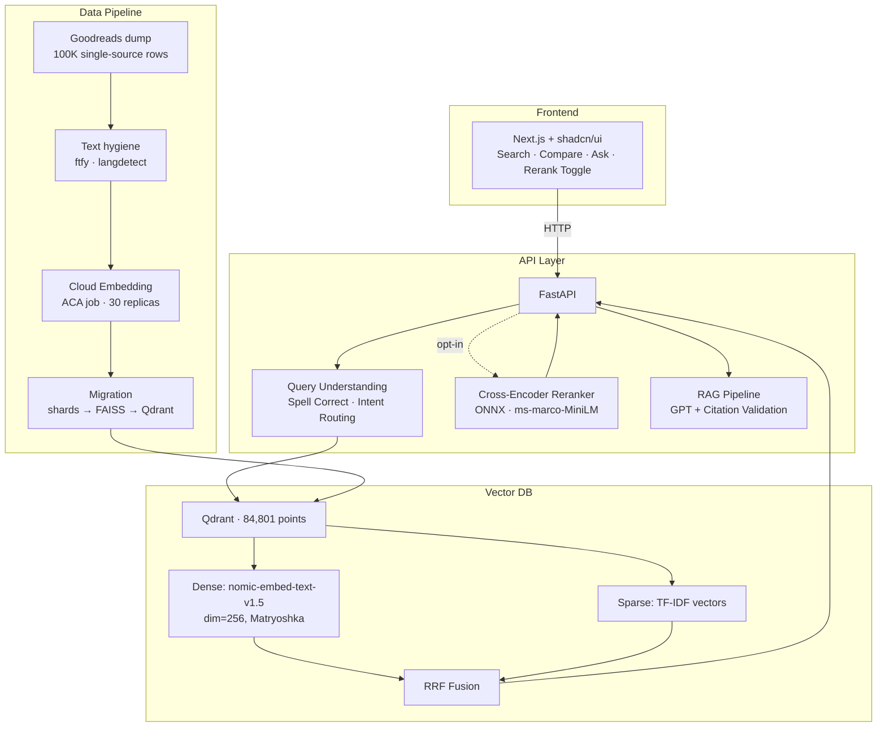
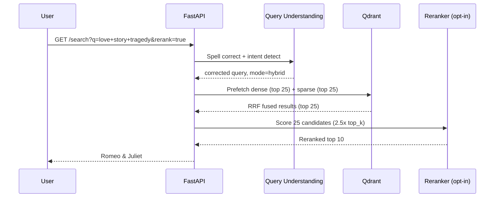
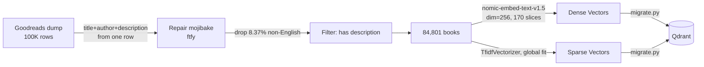
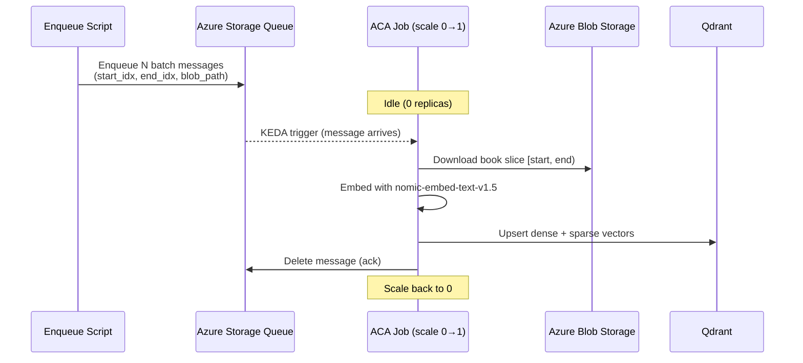

# 📚 BookSearch — Hybrid Semantic Search Engine

### **[▶ Try it live](https://black-grass-0df1c7a0f.7.azurestaticapps.net/)** · [API docs](https://booksearch-api.thankfulstone-e6f7cf40.eastus.azurecontainerapps.io/docs) · [Evaluation](docs/EVALUATION.md)

A hybrid search engine over 84,801 books. TF-IDF sparse retrieval fused with dense vector search (nomic-embed-text-v1.5) via Reciprocal Rank Fusion, plus an optional cross-encoder reranker — self-hosted on Qdrant, deployed to Azure Container Apps with full CI/CD.

Every quality claim below is measured against the live deployment and [reproducible from this repo](docs/EVALUATION.md#reproducing) — including the ones that came out badly.

---

## Architecture



<details>
<summary><b>Query Flow</b> — a search request through fusion and reranking</summary>



</details>

<details>
<summary><b>Data Pipeline</b> — how 100K raw rows become 84,801 indexed books</summary>



</details>

<details>
<summary><b>Embedding Worker</b> — event-driven, scale-to-zero batch embedding</summary>



</details>

Every field on a record comes from the same source row, so a description can never be
attached to another author's book. That is the whole reason for the migration — see
[Corpus History](docs/CORPUS_HISTORY.md).

---

## Tech Stack

| Layer | Technology |
|-------|-----------|
| **Frontend** | Next.js 16, TypeScript, Tailwind CSS, shadcn/ui |
| **API** | FastAPI, Python 3.11, Pydantic |
| **Vector DB** | Qdrant (self-hosted, Docker) |
| **Embeddings** | nomic-embed-text-v1.5 (Matryoshka, dim=256) |
| **Sparse Retrieval** | TF-IDF (scikit-learn) |
| **Reranker** | cross-encoder/ms-marco-MiniLM-L-6-v2 (ONNX Runtime) |
| **RAG** | Azure OpenAI (GPT) with citation validation |
| **Query Understanding** | SymSpell (spell correction) + intent routing |
| **Cloud Infra** | Azure Container Instances, ACR, Blob Storage |
| **IaC** | Bicep (ACA templates ready) |

---

## Features

- **Hybrid Search (RRF)** — Reciprocal Rank Fusion of TF-IDF + dense vectors: keyword precision plus semantic understanding.
- **Cross-Encoder Reranker** — Optional two-stage retrieval, ONNX-optimized for CPU with length-bucketed batching. Opt-in because it costs ~2.2 s; see [where it helps most](docs/EVALUATION.md#where-reranking-helps).
- **Query Understanding** — Spell correction (SymSpell), intent detection, query-adaptive mode routing.
- **RAG with Guardrails** — Natural language Q&A grounded in retrieved books. Citation validation prevents hallucinated titles.
- **Compare View** — Side-by-side 3-column comparison of keyword vs. hybrid vs. vector results.
- **Evaluation Framework** — Two independent harnesses (graded relevance with paired bootstrap CIs, and an objective known-item gate), an LLM judge validated against 89 hand-labeled pairs, and a [GitHub Actions workflow](.github/workflows/eval.yml) that runs the whole pipeline remotely.

---

## Eval Results

Two independent harnesses, both run against the live production deployment: a
**graded relevance eval** (100 corpus-grounded queries, **5,000 LLM-judged pairs**,
zero unjudged, paired bootstrap confidence intervals) and an objective
**known-item eval** (exact-title lookup — no judge, no pooling, verifiable by hand).

> Full methodology, per-category breakdowns, judge validation and limitations:
> **[docs/EVALUATION.md](docs/EVALUATION.md)** · corpus history and the v1 data bug:
> **[docs/CORPUS_HISTORY.md](docs/CORPUS_HISTORY.md)**

### Retrieval Quality (k=10, v2 84,801-book corpus, n=98)

| Mode | MRR@10 | NDCG@10 | Recall@10 | Median latency |
|------|--------|---------|-----------|----------------|
| Keyword (TF-IDF) | 0.889 [0.832, 0.937] | 0.633 [0.582, 0.682] | 0.331 [0.283, 0.380] | 141 ms |
| Vector (nomic-256d) | 0.951 [0.910, 0.986] | 0.750 [0.710, 0.790] | 0.392 [0.345, 0.441] | 212 ms |
| Hybrid (RRF) | 0.953 [0.915, 0.985] | 0.754 [0.714, 0.793] | 0.414 [0.361, 0.471] | **216 ms** |
| **Hybrid + Rerank** | **0.982 [0.954, 1.000]** | **0.835 [0.799, 0.865]** | **0.450 [0.398, 0.501]** | 2,158 ms |

Paired deltas (bootstrap over per-query differences, all six intervals exclude zero):

| Comparison | NDCG@10 | 95% CI |
|------------|---------|--------|
| Hybrid − Keyword | **+0.121** | [+0.087, +0.158] |
| Hybrid+Rerank − Hybrid | **+0.081** | [+0.054, +0.110] |
| Hybrid+Rerank − Keyword | **+0.202** | [+0.159, +0.250] |

**What 0.982 actually means.** That counts grade ≥ 1 as relevant, a lenient bar on
this pool — shuffling the pool scores 0.598. Under a **strict** grade-2-only
threshold the ranking holds and reranking's margin over hybrid *grows* from +0.029 to
**+0.114**: it pulls the *best* document to rank 1, not merely a relevant one. A
perfect reranker over the same 25 candidates would score 0.940, so the cross-encoder
captures **44%** of available headroom — the rest is a retrieval problem, not a
ranking one. ([full tables](docs/EVALUATION.md#threshold-sensitivity-what-0982-actually-means))

### Known-Item Accuracy (50 titles sampled from the v2 index)

| Mode | Acc@1 | Acc@5 | MRR |
|------|-------|-------|-----|
| **Vector (nomic-256d)** | **94%** | 96% | 0.950 |
| Hybrid (RRF) | 86% | **98%** | 0.917 |
| Keyword (TF-IDF) | 66% | 80% | 0.732 |

**Hybrid no longer wins at rank 1.** On v1, hybrid (94%) sat between vector (100%)
and keyword (74%). On v2 the keyword arm degrades to 66% and RRF propagates it, so
hybrid falls *below* pure vector while still holding the best top-5 recovery. Fusion
is still buying recall, at a cost in top-1 precision that did not exist at 26K
records — the concrete evidence behind "TF-IDF over BM25" being the closest call in
the decisions table below.

A paired run of both arms over identical queries against the identical index:

| Fixture | Hybrid Acc@1 | + Rerank | Fixed | Broken | McNemar *p* |
|---------|--------------|----------|-------|--------|-------------|
| Standard (n=50) | 86.0% | **98.0%** | 6 | **0** | 0.031 |
| Hard variants (n=30) | 73.3% | **90.0%** | 5 | **0** | 0.0625 |

**Zero regressions across 80 paired queries.** This harness doubles as a CI gate:
every deploy re-runs it against the live container and fails the build if either arm
drops more than 5 points below baseline.

### Key Findings

All three are bugs the evaluation caught **in my own code** — which is mostly what
the harness has been worth.

- **Hybrid search was silently non-deterministic.** Qdrant's RRF gives tied documents
  bit-identical scores and broke those ties by segment-merge order, so **8 of 40
  queries returned a different #1 book** on back-to-back identical requests. Caught
  only because two runs agreed *exactly* on every other mode and disagreed on hybrid.
  [Cause and fix →](docs/EVALUATION.md#determinism)
- **Reranking looked harmful because I was truncating passages at `[:300]` chars**,
  discarding **60.2% of description text across 62% of documents** — the cross-encoder
  scored fragments while RRF fused the full index. Fixing it exposed a second bug
  underneath: full-length passages tripled the token count and pushed `rerank=true`
  past the ingress timeout on 1 vCPU (3/6 requests failed, one took 98 s). Truncation
  had been masking the fact that the container could not afford the work.
  [Details →](docs/EVALUATION.md#reranker-performance-engineering)
- **An earlier eval put hybrid within noise of keyword — the query set was the
  artifact.** LLM-generated with no view of the corpus, it asked for *1984* and *The
  Great Gatsby* against an index of mostly obscure works, carrying no gold documents.
  Rebuilt from the corpus itself, the margin is a clear +0.121 NDCG. **The eval was
  measuring its own query set, not the system.**
  [Methodology →](docs/EVALUATION.md#methodology)

> Reranking stays an **opt-in toggle**. The gain is real and reproduced two ways,
> but ~2.2 s is too slow to impose on every search when plain hybrid answers in
> ~216 ms. It is worth the wait on exploratory queries — "love story tragedy"
> returns Romeo & Juliet first with reranking on.

### The Short Version of the Caveats

The LLM judge agrees with a human only **~2/3 of the time** (Cohen's kappa **0.314**),
and every graded number rests on that. **Recall is capped at 0.559** by pooling, so it
is not comparable across systems. **Per-category results are underpowered** — `author`
(n=13) and `combined` (n=9) have intervals that include zero. The corpus was migrated
after a **12.8%-floor description-provenance defect** was found by hand-labeling, a bug
the automated eval was structurally blind to.

All expanded, with the reasoning, in [docs/EVALUATION.md](docs/EVALUATION.md) and
[docs/CORPUS_HISTORY.md](docs/CORPUS_HISTORY.md).

---

## Getting Started

### Prerequisites

- Python 3.11+
- Docker (for Qdrant)
- Node.js 18+ / pnpm (for frontend)

### Quick Start

```bash
# 1. Clone and install
git clone https://github.com/TruaShamu/ai-search.git
cd ai-search
pip install -r requirements.txt
cp .env.example .env    # then fill in values

# 2. Start Qdrant
docker run -d --name qdrant -p 6333:6333 -v qdrant_storage:/qdrant/storage qdrant/qdrant:latest

# 3. Run migration (loads data into Qdrant) -- see note below
python -m src.qdrant.migrate --qdrant-url http://localhost:6333 --collection books --recreate

# 4. Start API
export QDRANT_URL=http://localhost:6333
uvicorn src.api.main:app --host 0.0.0.0 --port 8000

# 5. Start frontend
cd web && pnpm install && pnpm dev
```

Open http://localhost:3000

> **Step 3 needs index artifacts that are not in git.** `migrate.py` reads `data/index/{faiss.index,metadata.jsonl}` (~190 MB) and the corpus under `data/processed/` (~106 MB); both are gitignored, so a fresh clone fails here with a missing-file error. Either skip steps 2–4 and point `NEXT_PUBLIC_API_URL` in `web/.env.local` at the deployed API, or rebuild the index from the [UCSD Goodreads dataset](https://cseweb.ucsd.edu/~jmcauley/datasets/goodreads.html) via `scripts/embed_worker.py` and `python -m scripts.assemble_shards` — see [Corpus History](docs/CORPUS_HISTORY.md) for how it was filtered.
>
> The test suite (`python -m pytest tests/`) mocks external services and runs on a clean clone with no data or credentials.

### Environment Variables

Copy `.env.example` to `.env` and fill it in — it lists every variable the project reads, with defaults and notes. The ones that matter for a local run:

| Variable | Description | Default |
|----------|-------------|---------|
| `QDRANT_URL` | Qdrant server URL | `http://localhost:6333` |
| `QDRANT_COLLECTION` | Collection name | `books` |
| `AZURE_OPENAI_ENDPOINT` | For query expansion and the RAG `/ask` endpoint | — |
| `AZURE_OPENAI_KEY` | For query expansion and the RAG `/ask` endpoint | — |
| `AZURE_OPENAI_DEPLOYMENT` | Chat deployment name | `gpt-54-nano` |
| `EVAL_API_URL` | Target for the eval harnesses | deployed URL |

> The deployed container also sets `AZURE_OPENAI_API_KEY` to the same secret. Only `AZURE_OPENAI_KEY` is read by the code; the alias exists because the two names are easy to confuse and a mismatch fails silently — query expansion and `/ask` degrade rather than error.

---

## Project Structure

```
src/
├── api/            FastAPI application (search, ask, health, stats)
├── qdrant/         Qdrant client (hybrid search) + migration script
├── search/         Embedding pipeline (nomic-embed-text-v1.5)
├── reranker/       Cross-encoder reranker (ONNX + PyTorch fallback)
├── rag/            RAG generation with hallucination guardrails
├── query/          Query understanding (spell, intent, expansion)
├── eval/           Evaluation framework (MRR, NDCG, Recall, known-item, LLM judge)
└── etl/            Data pipelines (single-source Goodreads corpus build)

web/                Next.js frontend (search UI, compare view, ask tab)
infra/              Bicep templates (ACA deployment)
scripts/            Cloud embedding automation + eval harnesses
docs/               Evaluation methodology + corpus history
data/
├── processed/      Indexed catalog (books_goodreads_v2.jsonl)
├── index/          Legacy FAISS index + TF-IDF vectorizer (pre-Qdrant; kept for the migration script only)
├── eval/           Evaluation datasets + results
└── models/         ONNX reranker model
```

### Documentation

| Document | Contents |
|---|---|
| [docs/EVALUATION.md](docs/EVALUATION.md) | Full eval methodology, all result tables, threshold sensitivity, judge validation, limitations, and how to reproduce |
| [docs/CORPUS_HISTORY.md](docs/CORPUS_HISTORY.md) | Where the data came from, the v1 description-provenance bug, what the v2 migration changed, and the archived v1 results |
| [docs/embedding-model-selection.md](docs/embedding-model-selection.md) | Six embedding models compared on MTEB retrieval, CPU throughput, size and Matryoshka support, and why the 274 MB model beat the 900 MB one |

Three further documents — [embedding-strategy.md](docs/embedding-strategy.md),
[eval-improvement-plan.md](docs/eval-improvement-plan.md) and
[progress.md](docs/progress.md) — are kept as a historical record. Each opens with a
status banner naming what it got wrong and what replaced it, because several were
written before the corpus migration and the move off Azure AI Search.

---

## Design Decisions

| Decision | Rationale |
|----------|-----------|
| **Qdrant over Azure AI Search** | Measured 15x faster at the time of migration (24ms vs 370ms), plus no tier limits, built-in RRF, and self-hosting. The Azure resource has since been decommissioned, so that comparison is no longer reproducible from this repo |
| **TF-IDF over BM25** | Sufficient at the current scale; hybrid compensates. BM25's length norm matters more as the index grows — at 84.8K docs this is now the closest call in the table and the most likely next change |
| **Matryoshka dim=256** | nomic-embed-text-v1.5 trained checkpoints: 768/512/256/128/64. 256 balances quality vs. index size |
| **Reranker opt-in** | ~1.8s of cross-encoder time, down from ~3.6s after length-bucketed batching. The quality gain is real and reproduced two independent ways ([results](#eval-results)), but it is still too slow to impose on every search, so it is off by default and toggleable per query |
| **Single-source corpus** | Replaced a title-matched OpenLibrary+Goodreads join that provably mislabeled ≥12.8% of descriptions. Title, author, and description now come from one row, so the error cannot be represented |
| **English-only index** | Measured: a Spanish translation scores 0.635 against an English query where an English paraphrase scores 0.787 and an unrelated English sentence scores 0.274 — foreign text outranks genuine matches, and the English-only reranker cannot fix it |
| **ONNX reranker** | 3.7x faster than PyTorch on CPU (23ms vs 86ms for 4 candidates) |
| **Cloud embedding (ACA job)** | Local GPU unavailable. 30 parallel replicas embed 84.8K docs in ~50 min. Each reads one pre-cut slice blob rather than the whole corpus: measured +4.9 MB resident vs +429 MB, which is what fixed the OOMKill |
| **API at 2 vCPU, always-on** | Measured, not guessed. At 1 vCPU with `minReplicas: 0`, removing the reranker's passage truncation pushed `rerank=true` past the ingress timeout (3/6 requests failed, one took 98s), and the first request after idle paid a ~20s model load. Separate liveness (`/health`) and readiness (`/ready`) probes stop ingress routing to replicas that are still loading |

---

## API Endpoints

| Endpoint | Method | Description |
|----------|--------|-------------|
| `/search` | GET | Hybrid search with mode, rerank, filters |
| `/search/compare` | GET | Side-by-side results across all modes |
| `/ask` | POST | RAG question answering with citations |
| `/health` | GET | Liveness probe — reports backend, model warmup state, and reranker availability. Always 200 while the process is up |
| `/ready` | GET | Readiness probe — 503 until models finish loading, so ingress skips cold replicas |
| `/stats` | GET | Index statistics |

### Example

```bash
# Hybrid search
curl "http://localhost:8000/search?q=scottish+romance&mode=hybrid&top_k=5"

# With reranking
curl "http://localhost:8000/search?q=love+story+tragedy&rerank=true"

# RAG question
curl -X POST http://localhost:8000/ask \
  -H "Content-Type: application/json" \
  -d '{"question": "What are some good books about Scottish history?"}'
```

---

## License

MIT
