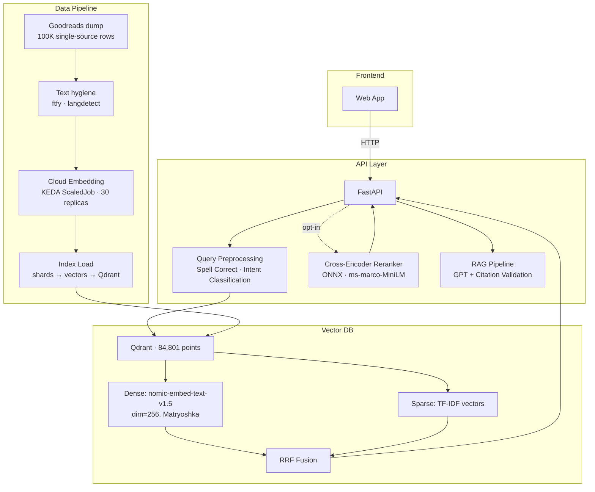
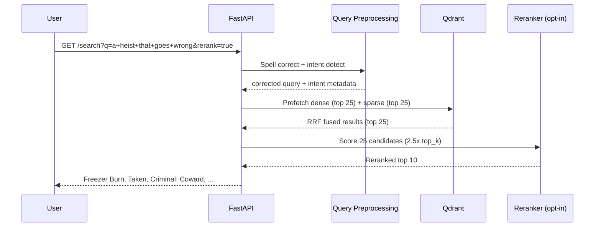
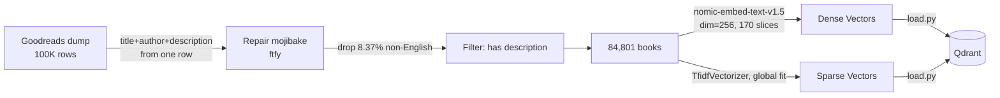
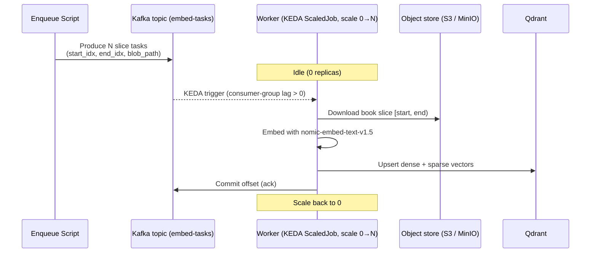

# 📚 BookSearch — Hybrid Semantic Search Engine

### **[▶ Try it live](https://black-grass-0df1c7a0f.7.azurestaticapps.net/)** · [API docs](https://booksearch-api.thankfulstone-e6f7cf40.eastus.azurecontainerapps.io/docs) · [Evaluation](docs/EVAL_RESULTS.md)

Search 84,801 books by what they are *about*, not what they are called. Ask for *"a heist that goes wrong"* and the top hits are *Freezer Burn* and *Criminal: Coward* — neither shares a single word with the query.

Under the hood: TF-IDF sparse retrieval fused with dense vector search (nomic-embed-text-v1.5) via Reciprocal Rank Fusion, plus an optional cross-encoder reranker — self-hosted on Qdrant. **Portable by design**: the whole system runs on vendor-neutral, cloud-native infrastructure (Kubernetes + KEDA, Apache Kafka, S3/MinIO), with Azure Container Apps kept as a reference cloud deployment. Full CI/CD.

A **RAG pipeline** sits alongside search: natural-language Q&A grounded in retrieved
books, with citation validation that rejects hallucinated titles before they reach
the user.

---

## Architecture



---

## Search Algorithm

A query goes through three stages: preprocessing, retrieval, and optional reranking.

**Query preprocessing** applies SymSpell correction against a corpus-derived dictionary
and returns rule-based intent metadata. It does not route retrieval: keyword, vector,
or hybrid remains selected by the request parameter.

**Retrieval** fetches 25 candidates from each arm — TF-IDF sparse and nomic-embed-text-v1.5
dense (Matryoshka dim=256) — and fuses them with Reciprocal Rank Fusion inside Qdrant.
The sparse arm gives keyword precision ("1984" finds *1984*); the dense arm gives
semantic reach ("a heist that goes wrong" finds *Freezer Burn*). Hybrid buys both:
**+0.121 NDCG over keyword, +0.004 over dense**, with the best Recall@10 of any
single-stage mode.

**Reranking** is opt-in because it costs ~1.8 s. An ONNX-optimized cross-encoder
(ms-marco-MiniLM-L-6-v2) re-scores the top 25 candidates. Length-bucketed batching
cuts inference time from 3.6 s to 1.8 s. The payoff: **+0.081 NDCG over hybrid**,
and the margin **nearly quadruples under a stricter relevance bar**
([threshold sensitivity](docs/EVAL_RESULTS.md#threshold-sensitivity-what-0982-actually-means)).



---

## Data Pipeline

100K raw Goodreads rows become 84,801 indexed books through an ETL that enforces a
single-source constraint: every field on a record comes from the same source row, so a
description can never be attached to another author's book. That constraint is the
reason the corpus was rebuilt from scratch rather than patched — the v1 provenance bug
affected a **12.8% floor** of records
([Corpus History](docs/CORPUS_HISTORY.md)).



**Embedding** uses a KEDA-scaled work queue with up to 30 worker replicas. On
Kubernetes this is a KEDA `ScaledJob` that scales 0→30 on **Apache Kafka**
consumer-group lag; the same worker runs unchanged on Azure Container Apps
against a Storage Queue (the reference cloud path). Pre-sliced ~500-book inputs
reduced per-worker memory growth from 429 MB to 4.9 MB, eliminating OOMKills;
84.8K books embedded in ~50 minutes.



The pipeline is three stages in `src/indexing/`: **worker** (embed slices) →
**assemble** (stitch shards into `embeddings.npy` + `metadata.jsonl`) →
**load** (fit the global TF-IDF vectorizer and upload everything to Qdrant).
The TF-IDF fit *must* be global — fitting per slice would silently produce
incompatible sparse vectors between the index and the query encoder.

---

## Evaluation

Two independent harnesses, both run against the live deployment. Full methodology,
per-category breakdowns, judge validation and limitations:
**[docs/EVAL_METHODOLOGY.md](docs/EVAL_METHODOLOGY.md)** · **[docs/EVAL_RESULTS.md](docs/EVAL_RESULTS.md)**.

### Graded Relevance (k=10, 84,801-book corpus, n=98)

100 corpus-grounded queries, **5,000 LLM-judged pairs**, zero unjudged, paired
bootstrap confidence intervals.

| Mode | MRR@10 | NDCG@10 | Recall@10 | Median latency |
|------|--------|---------|-----------|----------------|
| Keyword (TF-IDF) | 0.889 [0.832, 0.937] | 0.633 [0.582, 0.682] | 0.331 [0.283, 0.380] | 141 ms |
| Vector (nomic-256d) | 0.951 [0.910, 0.986] | 0.750 [0.710, 0.790] | 0.392 [0.345, 0.441] | 212 ms |
| Hybrid (RRF) | 0.953 [0.915, 0.985] | 0.754 [0.714, 0.793] | 0.414 [0.361, 0.471] | **216 ms** |
| **Hybrid + Rerank** | **0.982 [0.954, 1.000]** | **0.835 [0.799, 0.865]** | **0.450 [0.398, 0.501]** | 2,158 ms |

Paired deltas (all six intervals exclude zero):

| Comparison | NDCG@10 | 95% CI |
|------------|---------|--------|
| Hybrid − Keyword | **+0.121** | [+0.087, +0.158] |
| Hybrid+Rerank − Hybrid | **+0.081** | [+0.054, +0.110] |
| Hybrid+Rerank − Keyword | **+0.202** | [+0.159, +0.250] |

### Known-Item Accuracy (50 titles sampled from the index)

No judge, no pooling — sample a title, search it, check whether that book comes back.
This harness gates every deploy: the build fails if either arm drops 5 points below
baseline.

| Mode | Acc@1 | Acc@5 | MRR |
|------|-------|-------|-----|
| **Vector (nomic-256d)** | **94%** | 96% | 0.950 |
| Hybrid (RRF) | 86% | **98%** | 0.917 |
| Keyword (TF-IDF) | 66% | 80% | 0.732 |

**[Full methodology, evidence and caveats → docs/EVAL_RESULTS.md](docs/EVAL_RESULTS.md)**

---

## Getting Started

### Prerequisites

- Python 3.11+
- Docker (for Qdrant)
- Node.js 18+ / pnpm (for frontend)

### Quick Start

```bash
# 1. Clone and install
git clone https://github.com/TruaShamu/booksearch.git
cd booksearch
pip install -r requirements.txt
cp .env.example .env    # then fill in values

# 2. Start Qdrant
docker run -d --name qdrant -p 6333:6333 -v qdrant_storage:/qdrant/storage qdrant/qdrant:latest

# 3. Load the index into Qdrant -- see note below
python -m src.indexing.load --qdrant-url http://localhost:6333 --collection books --recreate

# 4. Start API
export QDRANT_URL=http://localhost:6333
uvicorn src.api.main:app --host 0.0.0.0 --port 8000

# 5. Start frontend
cd web && pnpm install && pnpm dev
```

Open http://localhost:3000, or check the API directly:

```bash
curl "http://localhost:8000/search?q=a+heist+that+goes+wrong&mode=hybrid&rerank=true"
curl -X POST http://localhost:8000/ask -H "Content-Type: application/json" \
  -d '{"question": "What are some good books about Scottish history?"}'
```

> **Step 3 requires ~300 MB of index artifacts not in git.** Skip steps 2–4 and point the frontend at the deployed API, or rebuild from the [UCSD Goodreads dataset](https://cseweb.ucsd.edu/~jmcauley/datasets/goodreads.html) — see [Corpus History](docs/CORPUS_HISTORY.md).
>
> The test suite (`python -m pytest tests/`) mocks external services and runs on a clean clone with no data or credentials.

### Environment Variables

Copy `.env.example` to `.env` and fill it in — it lists every variable the project reads, with defaults and notes. The ones that matter for a local run:

| Variable | Description | Default |
|----------|-------------|---------|
| `QDRANT_URL` | Qdrant server URL | `http://localhost:6333` |
| `QDRANT_COLLECTION` | Collection name | `books` |
| `AZURE_OPENAI_ENDPOINT` | For the RAG `/ask` endpoint, the LLM judge, and query generation | — |
| `AZURE_OPENAI_KEY` | For the RAG `/ask` endpoint, the LLM judge, and query generation | — |
| `AZURE_OPENAI_DEPLOYMENT` | Chat deployment name | `gpt-54-nano` |
| `EVAL_API_URL` | Target for the eval harnesses | deployed URL |

---

## Project Structure

`src/` is the system: one package each for the API, Qdrant client, embedding
model, indexing pipeline, reranker, RAG, query preprocessing, eval framework and
ETL. `src/indexing/backends/` holds the pluggable queue (Kafka / Azure) and
object-store (S3 / Azure) backends. `web/` is the Next.js frontend, `deploy/`
the portable Kubernetes deployment (Helm for infra, Kustomize for the app),
`infra/` the Azure Bicep reference templates, and `data/` the corpus, eval sets
and ONNX model.

The indexing pipeline is the substantial part: `src/indexing/worker.py` runs as a
queue-driven worker that scales 0→30 replicas (a KEDA `ScaledJob` on Kafka lag in
Kubernetes, or an event-driven Azure Container Apps job), each embedding one slice
of the corpus, and `src/indexing/assemble.py` stitches the resulting shards into
the dense vector array and metadata that `src/indexing/load.py` fits the TF-IDF
vectorizer over and uploads.

### Deployment

Portable by design — see **[deploy/README.md](deploy/README.md)** for the
Kubernetes path (Helm-installed Kafka/Qdrant/MinIO/KEDA + Kustomize app manifests)
and a local `docker-compose` stack. The Azure Container Apps Bicep in `infra/`
remains a supported reference deployment; the same images run on either by
setting `QUEUE_BACKEND` / `OBJECT_STORE_BACKEND`.

### Documentation

| Document | Contents |
|---|---|
| [docs/EVAL_METHODOLOGY.md](docs/EVAL_METHODOLOGY.md) | How the eval works: harness design, query generation, judging, determinism, judge validation, reproducing |
| [docs/EVAL_RESULTS.md](docs/EVAL_RESULTS.md) | Full result tables, threshold sensitivity, paired comparisons, ceiling analysis, known-item accuracy, reranker performance |
| [docs/CORPUS_HISTORY.md](docs/CORPUS_HISTORY.md) | What the corpus is, how it was cleaned, the v1 data defect, and the archived v1 results |
| [docs/EMBEDDING.md](docs/EMBEDDING.md) | Why nomic-embed-text-v1.5 over five alternatives, the embedding template, dimensionality choice, and the TF-IDF sparse arm |
| [docs/SEARCH.md](docs/SEARCH.md) | Dense and sparse retrieval arms, RRF fusion and its limitations, query preprocessing pipeline and its limitations |
| [docs/RERANKER.md](docs/RERANKER.md) | Two-stage retrieval design, ms-marco-MiniLM-L-6-v2 and its limitations, ONNX optimization, length-bucketed batching |

---

## License

MIT
